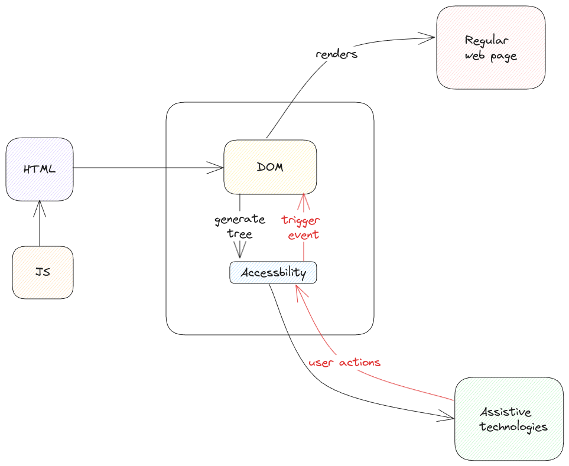

# ARIA

ARIA(Accessible Rich Internet Applications) is a set of specifications developed
to enhance accessibility of web content for people with disabilities.

Every browser implements these specifications which are then consumed by assistive technology devices.

## Role

For every HTML element, there is a role defined. The list of possible roles are defined by ARIA.

The role for each element can be manually set by the page developer and if not set,
this is implicitly calculated by the browser while generating the accessibility tree for a page.

## Accessible Name

For each HTML that's accessible, there is also a name calculated by the browser.
This name will be **unique** within the accessible tree of the page.

The developer can also provide names using `label` or `aria-label` attributes and
the browser will automatically consider this while generating the accessibility tree of the page.

## Accessible Elements

Not all HTML elements in the DOM are by default accessible.
For example a span or a div has no meaning until it has a details associated with it.
We must use ARIA attributes to attached details to it.

Instead, if we simply use **semantic elements** such as header, main, article, img, p, section,
then the elements are already accessible since the purpose of these elements are clear.

:::tip accessibility isn't about interacting
Here accessibility means if the element can be understood by accessibility devices.
Doesn't mean if the element can be clicked.
:::
