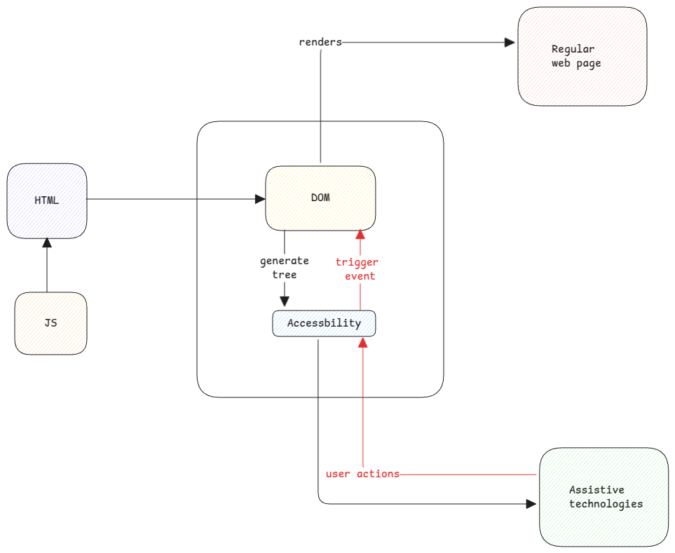

# ARIA

ARIA(Accessible Rich Internet Applications) is a set of specifications developed to enhance accessibility of web content for people with disabilities.

Every browser implements these specifications which are then consumed by assisstive technology devices.

## Role

For every HTML element, there is a role defined. 
This is implicity set by the browser while generating the accessibility tree for a page. 
