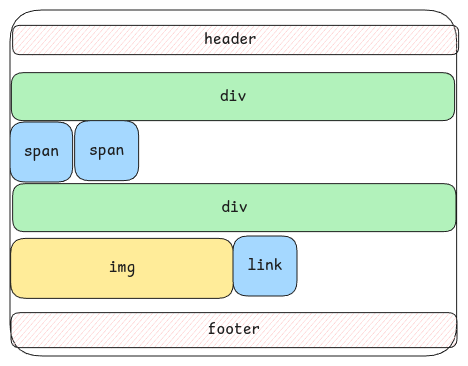

# Block vs Inline Elements

Block elements

- takes a new line in the HTML page.
- takes the full available width of the parent container by stretching fully.
- each block element can contain other child block or inline elements.

Example - `
, 
, <h1-7>, <header>, <footer>, <section>, <table>`, etc.

Inline Elements

- doesn't start on new line.
- width is as much as the content length. If the content is more then the available size,
  then content overflows to next line.
- inline elements can't contain other block elements as its child elements.

Example - `, <em>, <strong>, <a>, ,` etc.

## Normal Flow

This is the sequence in which HTML renders when no CSS is used at all.
All the details written above is for the normal flow.
With CSS, we tweak this very normal flow.

:::important[default width of block elements]
The width of a block element is always as big as its container.
It stretches fully. But it's not done by padding.

It just blocks that entire width even if the content isn't big enough.
:::

:::tip[understanding normal flow]
It's important to understand the normal flow completely to understand and use CSS.
:::

## Parent vs Child

By default, all content of the child elements of an HTML element will be fit into the size of the
parent container.

:::tip[Remember Parent-Child]
We can remember it this way: a parent wraps itself around his/her child, to show it loves them. :D

So container is just a box, basically, empty until something goes inside it.
Parent is the relationship to the thing inside it (the child).
You can make an empty `
` that's a container,
but it isn't a parent until there's a child element for it to wrap itself around (like an ``).
:::
