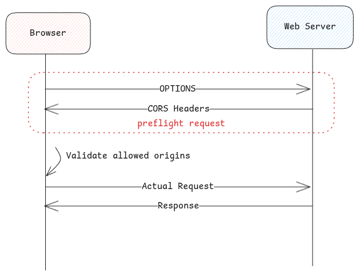

# CORS

## Why CORS - Cross Origin Resource Sharing

In the past there was only SOP - Same-Origin Policy. Which means, the website could only interact with resources on the same domain.

CORS was only introduced to relax this restriction. This also introduces a risk that if CORS isn't configured correctly, this can
lead to security issues.

## Origin Header

This is similar to **referer** header but doesn't disclose the path of the source page.

This can also be controlled by the **referral-policy** header.

:::tip[For Browsers]
These headers are used by browsers to avoid sending the request to the web server if the preflight response doesn't satisfy the conditions.
This provides security and also avoid unnecessary calls to web server.
:::

## Origin vs Referer Header

Origin and Referer are similar HTTP headers but only the purpose is different.

Referer is used to know from which source the request is coming. This is mainly for **statistical** purposes.

Whereas, Origin is used to restrict control of access to resources on other domains.

## Origin vs Host Header

Origin and referer contains the information of the browser sending the request.

Host contains the information of the server to which the request is being sent to.

:::tip[Important Links]
https://portswigger.net/web-security/cors#what-is-cors-cross-origin-resource-sharing
:::
