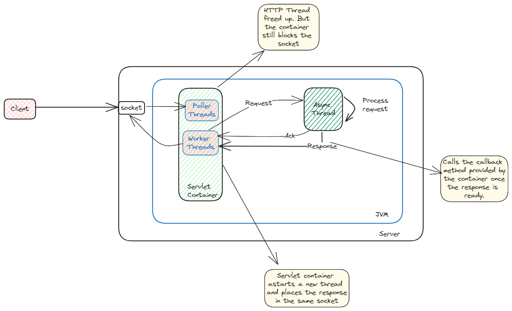
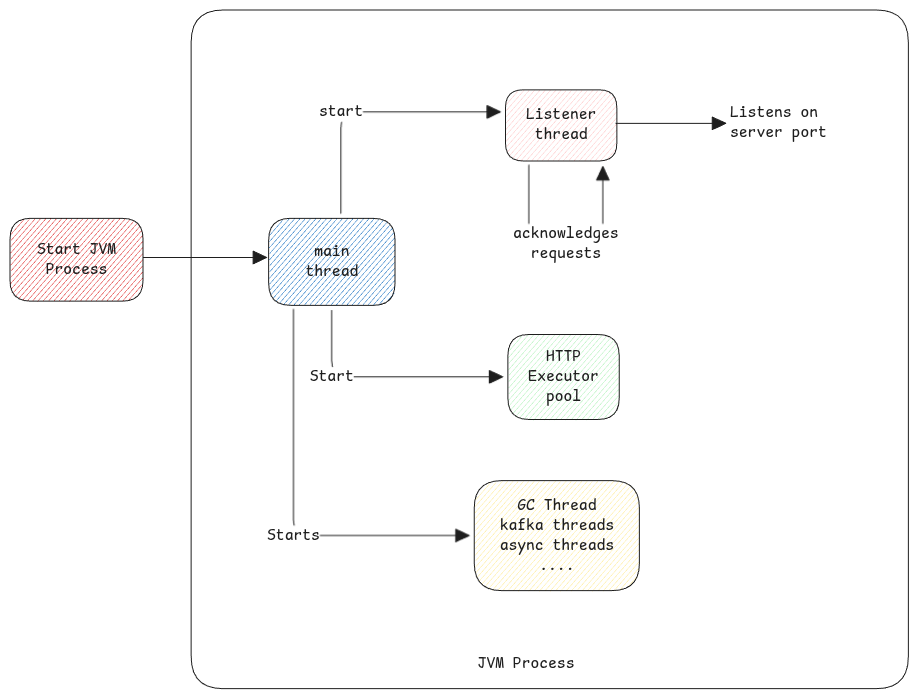

# Asynchronous Servlets

Asynchronous servlets aren't same as NIO.
In NIO, it's about only ensuring the servlet thread pool isn't fully blocked waiting for the data to come-in.
Where as in asynchronous servlets are servlet thread itself is released after accepting the request
and the response is sent back with a new servlet thread from the pool.

The entire processing consists of 3 threads.

1. Request servlet thread - Accepts the request from client and hands over the asynchronous thread.
2. Asynchronous Processing thread - Which does the actual processing of the request.
3. Response servlet thread - Write the response back to client.

It's important to understand that the request servlet thread sends a callback method to asynchronous thread.
The callback method which is on a different **master** thread is then called by asynchronous thread when the
processing finishes and then the **master** thread places a task for the servlet thread pool to pickup
the send response to the topic.

:::tip Spring DeferredResult
Example of asynchronous servlet is the Spring's DeferredResult implementation.
:::

:::info[No change for clients]
There is no difference of the HTTP clients. The socket in which the request came in will remain connected.
It will remain connected until the timeout period.
:::

## Thread Creation

The main threads created listener and worker threads at the boot.

## Non-Blocking IO

The term non-blocking IO means, the process which is polling the machine's IO system for data isn't
being blocked when a request is processed.

In case of HTTP threads, they're 1:1 mapped with CPU threads. So blocking an active CPU thread waiting for
any response is expensive. Instead, the HTTP thread is released so that it can process other waiting
IO requests is more scalable.

## Port vs Socket

Port is a network property.

Where as socket is how a network connection is expressed in software.
Best explanation - UNIX socket is (in code) a data structure (or object) that you can use to send or receive data.
This object has two queue fields. One for incoming data and one for outgoing data.

:::info[Interesting Reads]

- [Understanding Servlet 3.0 Async Processing](https://ijunc2.github.io/2018/02/01/seventh.html)
- [Non-blocking I/O Explained Like I'm Five](https://www.codecentric.de/wissens-hub/blog/explain-non-blocking-i-o-like-im-five)
- [Spring NIO Connector vs BIO Connector Overview](https://velog.io/@hyunjong96/Spring-NIO-Connector-BIO-Connector)
- [Spring Reactive and Servlet Async Explained](https://dzone.com/articles/understanding-spring-reactive-servlet-async)

:::
