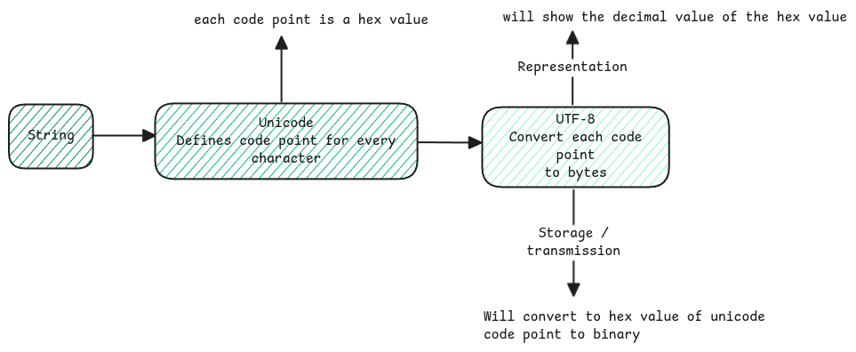

# Bytes to String Conversion

It's always told that the data is all stored in binary - 0 and 1's. 
But what's not clear is how this binary data is finally decoded and displayed as strings or any human understandable data. 

## Encoding and Decoding

When the source system generates a message for the destination system, 
the application on the producer side already encodes the string to byte data.

:::important[unicode vs UTF-8]
Unicode is the universal standard that defines a hexadecimal code point for all each character across all possible languages. 

UTF-8 is just the Unicode Transformation Format which encodes these Unicode code points to a variable byte representation.
:::

## Byte Data Representation
Bytes are nothing but binary 8 bit data. 
Just that when we run programs, the binary data isn't directly represented while debugging. 
The decimal values are shown. 

## Application Layer

Applications which sends out HTTP request or response, 
the headers are concatenated as one single string with new line separated and 
then converted to Unicode and encoded to UTF-8. 

Same process will be applied for request/response body. 

## Byte Order

When bytes (binary data) are transported between systems, 
the receiving system must know the sequence in which the bytes of a character must be processed. 

:::warning[Byte order]
Byte Order is about order of bytes within multi-byte value. 
If a character in Unicode results in multiple bytes, 
byte order then defines which byte must be considered as first byte of the character.
:::

There are two possible ways. 
1. Big Endian - Means the bits are processed from left to right. Like the usual way of reading. 
2. Little Endian - Here the bits are processed from right to left. The opposite way of reading. 

:::tip[what's Endian]
the Big-Endian / Little-Endian naming comes from Gulliver's Travels, 
where the Lilliputans argue over whether to break eggs on the little-end or big-end. 
:::

## Character Boundary

When a full string is streamed as UTF-8 encoded data, 
it's necessary for the receiving system to know which bytes are for which character. 
This is necessary since UTF-8 has multi-bytes in order to support all languages. 

Depending on the first few bits of the byte, 
the decoder can decide how many of the bytes including the current one belongs to a character. 
This means, there is no any extra byte to define the start of a new character. 

0xxxxxxx: A single-byte character.
110xxxxx: A two-byte character.
1110xxxx: A three-byte character.
11110xxx: A four-byte character.

:::tip[important links]
    - https://betterexplained.com/articles/understanding-big-and-little-endian-byte-order/
:::