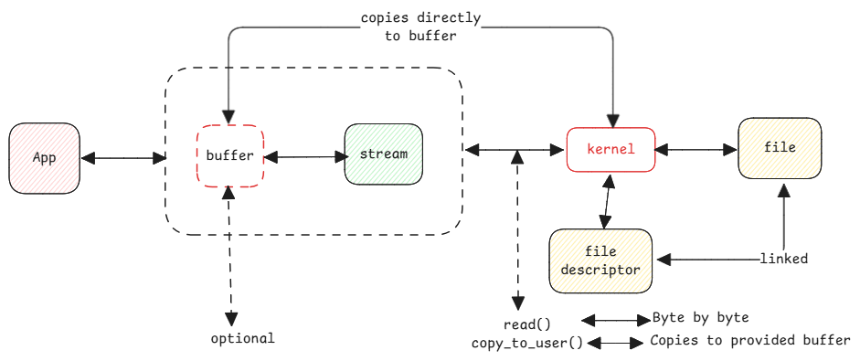

# Files

It's important to understand file management since everything is a file in Unix.
Also since all IO involves files, understanding the foundation of it's necessary in building
high-performance applications.
Everything in this document can be simply applied to all IO and not just regular hard disk files.

:::important Java file
Creating a new Java **File** object doesn't open the file.
Only creating a stream or channel will open the file.
:::

## Byte Buffers

ByteBuffer is a type in Java which allocates a fixed and continuous memory space
just to hold binary data. This is the type used in all IO operations.

## MappedByteBuffer

This is Java's implementation of MMIO.

In this case, the file is loaded into the memory and
then this part of memory address is mapped into the JVM process's memory space.

:::important Why the name buffer
Here there is no actual byte buffer used.
It's called buffer since it just acts as a bridge between JVM and the underlying file system.
:::

Since loading any file from ROM into memory includes the [page cache](../linux/memory-paging.md#swapping),
writing or reading data, it will be directly happening on the page cache.

:::tip mmap()
MappedByteBuffer is Java's wrapper to mmap() function.
Even the fileChannel.map() does the same.
:::

:::note writing to page cache
Writing to page cache avoid IO since updating page cache will mark the pages as dirty and
kernel will automatically flush the changes to disk.
:::

## Direct Buffers

In this case, buffers are requested additionally from memory outside of JVM.

The advantage is, the JVM memory is kept free for other tasks
and IO operations are performed using buffers outside of the JVM.

:::tip malloc()
Direct buffers are wrappers to malloc() native methods.
:::

## Stream vs Buffer

:::important IO Stream in Kernel
Streams in Java are nothing but the operating system's IO using [file descriptors](../storage/file-descriptors.md).

For example, when a file input stream is opened then the corresponding file descriptor is created.
A **read** call on the file descriptor then reads the file associated with the file descriptor.
:::

Streams don't have any memory. They must be routed to an other output to process data such as
buffer, system out, array, etc.
This means, when data is provided by the **read** system call, it's only reading one byte at a time.

### Copying between user and kernel space

When streams are used without buffers,
the kernel doesn't copy data between two memory spaces.
Instead for every byte a function call is done to kernel and kernel returns the next byte.

In case of buffers, the address of the buffer is passed to kernel and kernel copies data to that
buffer directly as part of system call.

:::danger read vs copy_to_user
when a stream is directly used without buffer, it translates to **read** method to kernel.
This method returns next byte.
The file descriptor linked to the stream knows the last read byte (offset).
:::

:::tip Interesting Reads

- [It's all about buffers, zero-copy, mmap, and Java NIO (Shawn Xu, Medium)](https://shawn-xu.medium.com/its-all-about-buffers-zero-copy-mmap-and-java-nio-50f2a1bfc05c)

:::
