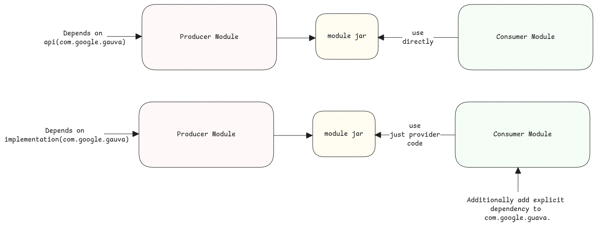

# Scopes

Scopes in Gradle are pretty much similar Maven except to one big difference between **api** and **implementation**.
In Maven, we've just **compile** scope but in case of Gradle this is split into two.

1. **api** - A dependency added with this scope will add even the transitive dependencies from the dependency
   to it's final jar.
2. **implementation** - This means the dependency is an implementation detail of the module and
   won't be exported to consumers of the module.
   The producer of the module itself will compile since Gradle will ensure the classpath contains the dependencies.

:::important Understanding the names
Initially when we hear the name **api**, it looks like it will only contain some APIs and no implementation.

But this is actually the opposite.
Here when we say **api**, it means the producer decides to add the corresponding dependency to it's final jar.

This means, the **api** scoped dependencies are actually larger than the ones which have just **implementation** scope.
:::

:::warning what happens at runtime?
At runtime Gradle doesn't exist.
Gradle will only ensure to build the jar accordingly and if there are any missing classes then the JVM will throw an error.
:::

## Test Fixtures

Gradle handles shared libraries related to tests differently.
In Maven, we usually write all tests and shared code related to test under **tests** folder.
Whereas in Gradle, we can use **testFixtures** folder for hosting all shared test code.

:::tip Test fixtures specific scope
Test fixtures have their own scopes - **testFixturesImplementation** and **testFixturesApi**.
These scopes works exactly like what **api** and **implementation** scopes does for productive code.

Gradle ensures such scoped dependencies are used only for the code in **testFixtures** folder.
So on one side it brings in different classpath for test fixtures and
at the same time, it will ensure what the consumers of the test fixtures module see.
:::

:::danger which code sees which dependencies?

1. Productive code - sees only **api** and **implementation** dependencies.
2. Test code - sees productive code plus **testImplementation** dependencies.
3. Test fixtures code - sees only **testFixturesImplementation** and **testFixturesApi** dependencies.

:::
