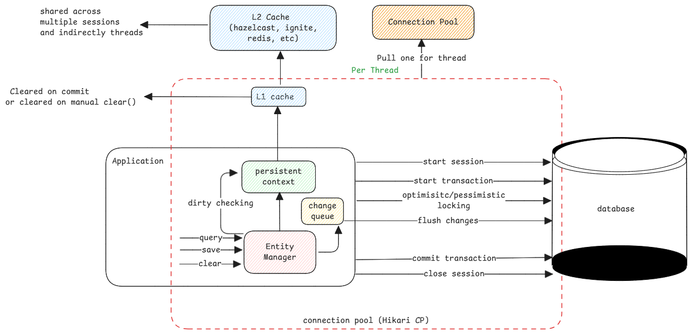

# JPA Transactions

In Spring, when we use **@Transactional** annotation on any method,
then the framework will start a session at the beginning of the method which is annotated
and then commit the all transactions in the entire thread when the method returns.

:::tip methods without **@transactional**
For methods without don't have a dedicated annotation

1. If calls are done via spring-data CrudRepository,
   these methods already have this annotation.
   So the transaction is handled at that level.
2. If direct calls are done, then every single query is handled
   as a separate transaction, executed and committed individually.
   :::

## Thread Safe Components

The following components are thread-safe in a JPA transaction

1. Entity Manager - All interactions to the database and persistent cache happens through this.
2. Persistent Context - Consider this as a map of DB entities known to the thread.
   This is also called the L1 cache.

## Shared Components

The following components are shared across threads

1. L2 Cache - Systems that can share DB entities across multiple threads.
   For example, Hibernate clears the cache entry if an entity is updated.
2. Connection Pool - The connections to the database are created and
   shared between threads.

:::important connection pools
The connection pool threads ensures the connection to the DB is kept alive always.

It's nothing but connection to the database URL, provide credentials
and keep ready to start a session.

It uses TCP keep-alive to ensure the connection remains active
as long as the connection pool is active.
:::

## Proxy Classes

Spring framework doesn't weave connection start and end code into the actual classes.
Instead if a class has a **transactional** annotation,
then a proxy class (and it's bean) is created which are then used by the calling application.

This proxy bean then first starts the transaction and then calls the real bean.

## Locking

Database locking features is implemented by JPA and hibernate.

Read more about it [here.](../databases/locking.md)

:::info sources

-   https://www.marcobehler.com/guides/spring-transaction-management-transactional-in-depth
-   https://vladmihalcea.com/spring-transaction-connection-management
-   https://vladmihalcea.com/hibernate-locking-patterns-how-do-pessimistic_read-and-pessimistic_write-work/
-   https://vladmihalcea.com/a-beginners-guide-to-java-persistence-locking/
    :::
