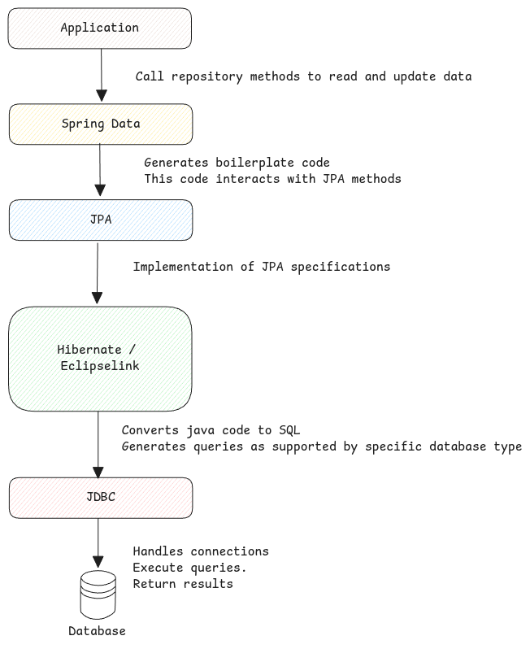

# Java Persistence APIs

These are the APIs and abstractions defined by the framework
which can be used Java application irrespective of the database used.

- Defines how the data in the database are converted to and from Java objects.
- APIs to perform actions on the database.

## ORM - Object-Relational Mapping

ORM aims to simplify database interactions by providing an abstraction layer
that translates between objects and database tables.
It enables developers to work with databases using the same language as the rest of their application.

Hibernate and Eclipselink are examples of such ORM libraries. They implement JPA specifications.

## Spring Data

Spring Data library doesn't implement JPA specifications.
Instead it only writes wrappers on JPA specifications which avoids writing boiler plate code for standard CRUD methods.

For the repositories which we create by extending **JpaRepository** and **JpaSpecificationExecutor** interfaces,
all queries are automatically added during compile time.

:::info[Repository Interfaces]
Repository interface is an example which automatically generates a lot of methods automatically.
:::

