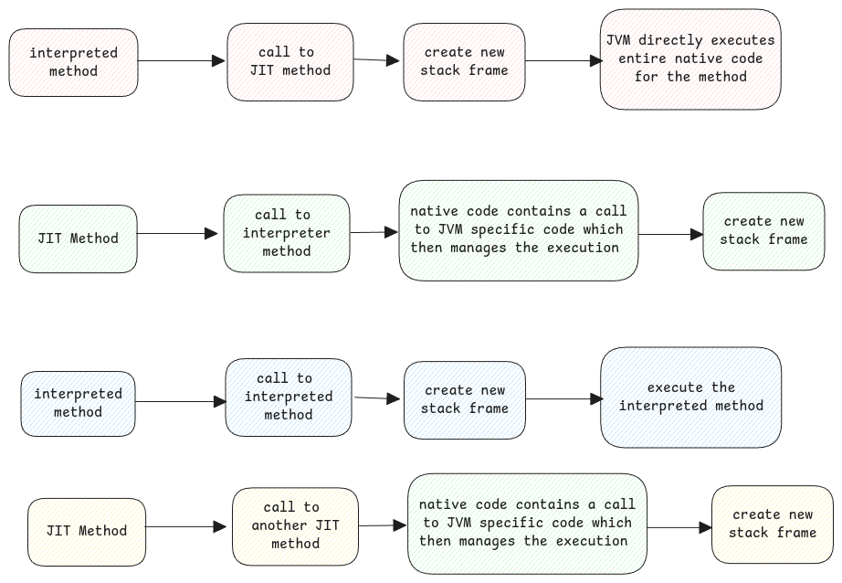

# JVM

It's called a virtual machine because it provides a layer of abstraction between Java application and the underlying physical machine.

## Instruction Set

Like how CPU has it's own instruction set, JVM also has its own instruction set and
JVM knows then how to map these JVM specific instruction set to the underlying CPU specific instruction set.

When Java class is compiled, the **.class** file generated will have a certain format which only the JVM can parse and understand.

:::info first byte
Always the first byte of the **.class** will have value 0XCAFEBABE
which was just implemented to have a relation with coffee.
:::

## Stack Based Virtual Machine

It's called a stack based virtual machine since it uses a stack to manage the code execution.

Stack frame is used to store state and also to control the execution flow.

## Program Counter

Similar to instruction pointers in CPU,
JVM also has a program counter which points to the byte code address from where the interpretation must start.

## Byte Code

It's called byte code because the Java code is converted into instructions which are length of a byte or more.

:::tip Provides dynamic resolution
Dynamic resolution such as SPI, runtime provided classes, etc are possible due to the intermediate byte code compilation.
If we compiled directly to native code, then such dynamic resolution and linking won't be possible.
:::

## Size of Byte Code

The conversion of plain Java code to byte code also ensures the size of the code is reduced.
Even though Java code seem to be verbose, but the generated Byte code ensures that the size remains less by doing a lot of optimization
and removing redundancies.

:::danger JVM mental model
JVM itself is a native compiled code.
This native code then translates Java's byte code to native code and
schedules execution of that code.
:::

## JVM Execution Engine

Each application thread inside the JVM has an instance of the execution engine which
executes the application byte code.

## Transition between interpreter and JIT code

While executing, the JVM encounters methods that are interpreted and also some which are JIT compiled.
JVM can handle the transition between these modes of execution seamlessly.

:::important stack traces
The stack trace in error logs what we see is the logical representation of the execution flow.
It need not follow the same in reality.

It translates the internal state of execution (which includes native code, interpreted bytecode,
and possibly multiple layers of abstraction like method inlining or JIT optimizations) into a human-readable,
logical view of how Java methods were called.

IDEs use JVM's debugging APIs to present this logical stack trace.
:::

## Operand Stack

Every stack frame in a JVM thread stack has it's own operand stack.
This holds the data of the arguments to call the next method.

JVM reads this data and copies them to the local variable area of the newly created stack frame.

And after the method returns, JVM copies the returned value to the operand stack of the calling stack frame.
