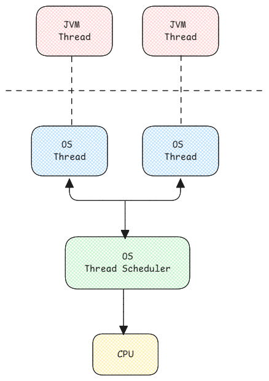

# Threads

In Java, all threads are created during the startup of the application.
This is because creating threads is a resource intensive process.

:::tip[Thread Resources]
Every thread also has memory allocated in RAM
and will remain until the thread is alive.
:::

Threads are created and are in an infinite loop waiting for tasks.

When the main thread of the application receives the request,
it just passes the request to the task queue from which the already created threads will pick up the work.

:::warning Sleeping Threads
The Java's thread object has a link to OS thread.

So when there is nothing running on the thread,
the OS method is called to put the thread to sleep.
This means the OS won't schedule the thread for CPU time until it's woken up.
:::

## Starting multiple threads

JVM always creates the main thread itself and
if the application code creates more threads,
it will just execute the thread creation code in the main thread.

When a new thread is created, JVM will create a new thread object in the heap memory
and will also create a corresponding OS thread.

## Inter Thread Communication

Threads can communicate between each other using **static**, **volatile**, **atomic** and **synchronized** concepts.

1. static - Shared variable that can be accessed from multiple threads.
2. volatile - Means the variable is constantly being updated hence must not be read from CPU cache instead from memory.
3. atomic - These are special variables where the update is allowed to be performed
   only when you pass the previous value and
   if the previous passed value is really the previous known value of the variable.
   Otherwise the update is rejected.
4. synchronous - A block of code that can be executed by one thread at a time.
   Other threads are simply paused until then.

## OS Threads vs JVM Threads

For each JVM thread has a corresponding OS thread.
This means the thread scheduling is managed by OS.
JVM only queues tasks for the threads which are then scheduled and executed by the OS.

:::tip[Important Links]

- [Java Memory Model: A Comprehensive Guide (medium.com)](https://dip-mazumder.medium.com/java-memory-model-a-comprehensive-guide-ba9643b839e)

:::
