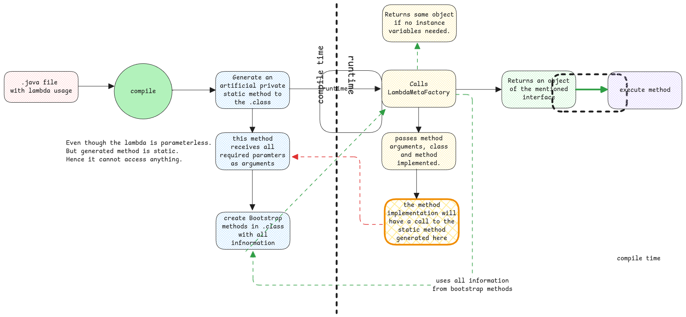

# Lambdas

In other programming languages such as Python and JavaScript,
a function can exist even without a class.
But in Java everything must be a class.
So the only way of achieving this in Java is using anonymous classes.

:::tip Function objects as first class citizens
In other programming language, functions are passed around as arguments to other functions.
This is exactly what the function object enables us to do.

Wherever you see the use of lambadas/anonymous classes/method references,
this is exactly what Java tries to emulate.
:::

## Anonymous Classes

Anonymous classes was the original way of creating function objects. It was just too verbose.
Additionally it allows having multiple methods.
This defeats the main purpose of function objects since function objects must contain just one function
similar to other programming languages.

:::warning anonymous classes vs function objects
Anonymous classes are function objects when it implements just one method.
If it implements more than one method, then it's a regular object.
:::

## Method Reference

It's another syntactic sugar to Lambdas.
It **refers to an existing method**.
That means, the function being passed has just one line code which simply calls another existing method.

## Compile Time and Runtime

During the compile time, the class isn't generated for lambdas like how it's done for anonymous classes.
Instead, only a private method and bootstrap method is generated for each function object in the class.
Then the LambdaMetafactory is use at runtime to generate the instance only at runtime.

