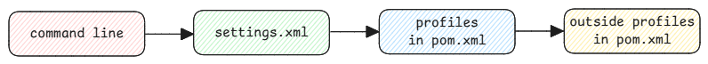

# Settings

Maven settings are user or system-wide configurations that controls how Maven behaves.

Until now I have used it for setting up proxies and mirrors.
But today came across an use case where even profiles can be defined in settings.xml.

:::tip Profiles in settings.xml
Using profiles we can add even other maven repositories to the list of repositories that are searched for dependencies.
This is useful when you want to use a custom repository for certain dependencies without modifying the `pom.xml` of your project.
:::

## Merge Configuration

When Maven reads the settings.xml file, it merges the configuration with the POM file.
This means that if a setting is defined in both the POM and settings.xml, the value from the settings.xml will override the one in the POM file.

:::info similar to other systems
Configuration precedence is similar to other systems like Gradle or NPM or Terraform
:::
