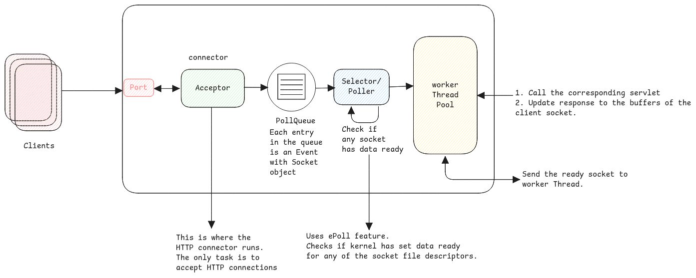

# Non-Blocking IO (NIO)

NIO is about not constantly blocking a thread by waiting for any IO to happen.

:::info[NIO is the default]
NIO is the default way of processing HTTP requests in Apache Tomcat.
This is exactly why we see the thread with name **http-nio-** in Spring Boot
:::

## Blocking IO (BIO)

1. JVM listens on the server port. Eg., 8080. This is the acceptor/main thread.
2. When a request arrives at the this port, then main thread then calls the `run` method of the new thread with the **socket** object to a thread.
3. The **Socket Processor** then converts the socket object to an HTTP request object and then calls the servlet.
4. This thread remains blocked until the **complete connection is closed.**
5. If all threads are used up, then no new sockets can be accepted and the client requests hangs.

:::info[TCP is Persistent]
There is always one TCP session used to exchange multiple HTTP messages between clients.
So the thread in the BIO case is blocked by one connection until it's fully closed.
:::

## Non-Blocking IO (NIO)

1. JVM listens on the server port. Eg., 8080. This is the acceptor/main thread.
2. The acceptor thread forwards the socket object to poller queue.
3. Poller then checks/polls the socket for messages.
4. Forwards it to thread pool whenever a message is available.

:::tip[Information Sources]

- https://www.cnblogs.com/kukuxjx/p/18013373
- https://velog.io/@hyunjong96/Spring-NIO-Connector-BIO-Connector
- https://blog.liu-kevin.com/2022/07/26/tomcatwang-luo-mo-xing/
  :::
