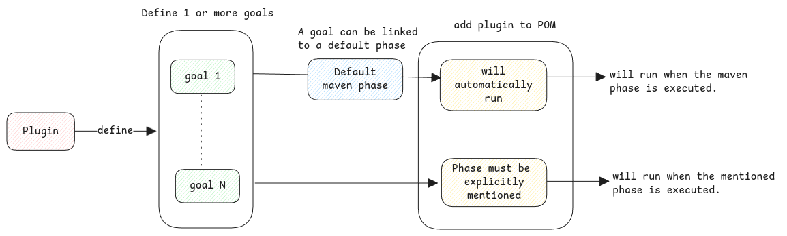

# Maven Phases and Goals

Phases are a fixed set of stages in the build lifecycle defined by the Maven framework.

:::important can't skip previous phases
When you run a specific phase of Maven,
it will always run all the previous phases in the lifecycle.
There is no way we can skip it.

Example - running install will run all the phases before it first and
then run install
:::

## Goals

Goals are custom user-defined names inside a Maven plugin.
If a plugin can do multiple things, we can separate them with different goals.

:::tip Plugins are everything
Maven binary itself can't do anything without plugin. Not even compile.

The binary itself only parses POM, downloads all dependencies and then lets it to plugin to handle everything.
:::
