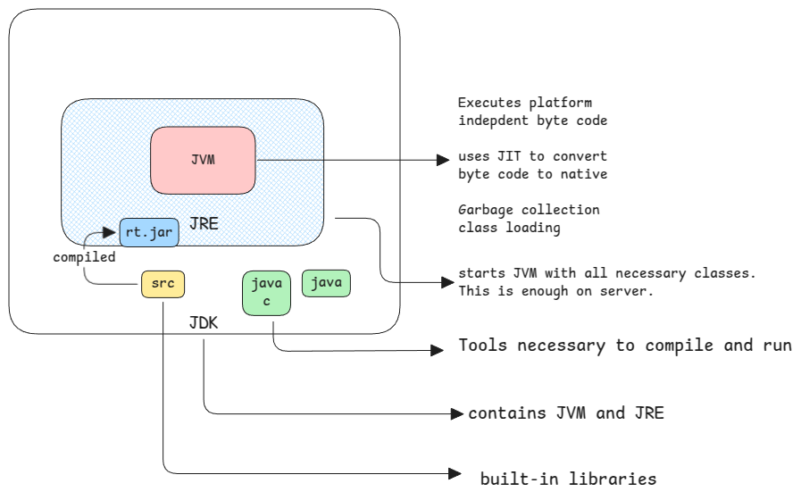

# JDK-JRE-JVM

Java is always told to be platform independent.
Which means, the code is written just once but can be executed on any platform.

## How's independence achieved

This comes from the 'byte code' which java generates.
It's an intermediate format of the code that can be understood only by the JVM.

And JVM is then capable of converting this intermediate byte code to the native code
based on the platform on which the Java program is executed.

:::info JIT compiler
Just-in-Time compiler of Java means how the JVM converts the byte code into native code
during the execution itself.

This is the difference compared to C or Go. The compiled output is already the native code.
:::

### Example

If we write a file open code in Java,
then the file handling code is automatically converted to Windows or Linux based on the platform
on which the JVM is running.

There is no special handling needed by the developer to handle different platforms.

:::tip only JVM is platform dependent
Only JVM has platform dependent implementation.
But since JRE contains the JVM and JDK contains JRE, even they become platform dependent.

This is why when you download JDK, you must specify the platform too.
:::

The only thing that JRE contains is the compiled version of built-in libraries.

