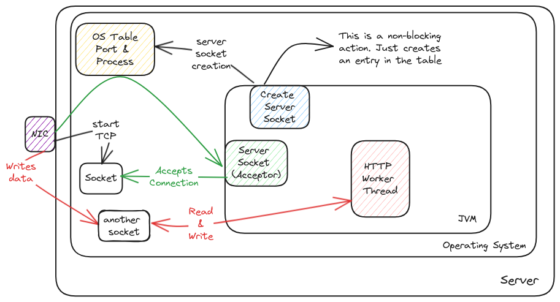

# Ports and Sockets

When we say an application/process wants to listen on a port, it simply calls a function in OS.
This native function then adds an entry to the table which has a map of port number
and pointer to a callback function of the application which must be informed when kernel receives any data on that port.

## Port

It's a network property but still only logical.
The network driver will open up the TCP-IP packets until layer 4 to see the destination IP and port.

## Server Socket

This is the actual object which basically lets the server application to hook into the port.
Here socket can be considered as the electrical socket where any appliance must connect if it needs to get power.

Whenever the application receives a wake up call from the kernel that there is data for the application,
then the application will **accept** this and return a **socket** object.

This is an infinite loop which will be polling/waiting for new connections.

:::info[Socket is like pipe]
This socket will be used by the entire network session to transfer data between source and destination.
The same socket can be used by multiple messages,
:::

## Socket

This is the actual object that's used by the application to read and send data back.

The acceptor thread then hands over the task to worker thread to process the data coming from socket.

:::info[Port and Sockets]
Port is just logical.

Socket is just an C object used to read data from buffer and also write response back to buffer.
:::

