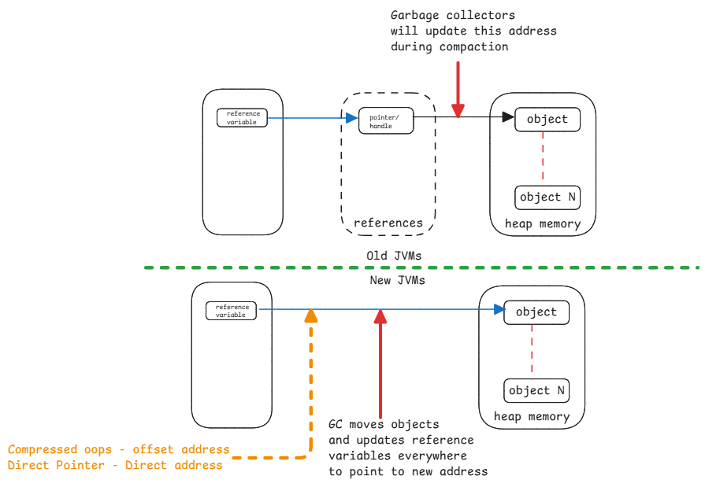

# Object References

References in Java is an abstract handle.
This means, it points to a memory address in heap but
the JVM ensures that the internal details aren't exposed.
There is no way we can get the actual address.

:::danger Different ways only to link reference variable to actual address
Java has provided different ways to link the reference variable to the actual address in memory.
This means, the reference variable has offset address, direct address, etc.

But all of these have the same abstract implementation.
We can't get the internal reference details.
:::

## Reference Variable to Memory Address

1. **Old JVM versions** - in between table has the link to direct memory address.
   Every reference variable has an entry in the table.
2. **Compressed Ordinary Object Pointers (Compressed OOPS)** - The references hold the actual address.
   But the address is an offset from the start of the heap address space.
   This avoids using 64 bit address pointers.
3. **Direct Pointer** - References to the direct address in the heap.

## Compaction

To fix fragmentation, the garbage collector compacts the heap memory by moving objects together
and updating their references.
This process helps to create larger contiguous blocks of free memory,
improving allocation efficiency and reducing fragmentation.

:::important Compaction is transparent
The compaction process where the address location of the objects is changed is transparent to the application.
This means that the application doesn't need to be aware of the changes in memory addresses.

This is exactly why the address is never disclosed by JVM.
:::

## Passing Reference in Methods

When object references are passed to methods, they're passed by value.
This means that a copy of the reference is made, not the actual object.
As a result, changes made to the object inside the method affect the original object,
while changes to the reference itself
such as assigning a different object to this reference don't affect the original reference.
