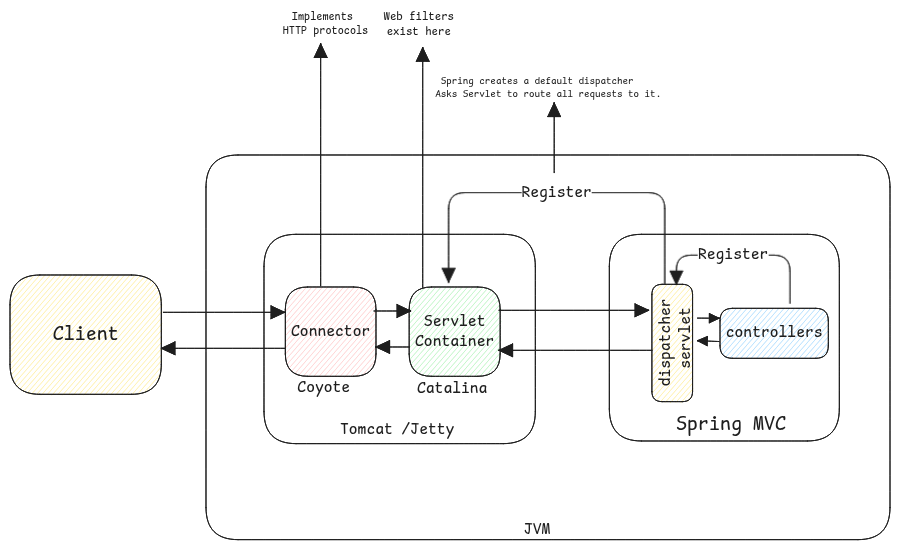

# Servlet Containers

Servlet containers are responsible for handling the HTTP requests and responses and
also knowing which Java bean to call whenever a request is received.

It receives the requests and
then runs through the HTTP filters and
then calls the actual Java class/method which will handle the request.

:::tip Servlet containers vs HTTP Servers
Plain HTTP servers only implement HTTP protocol and even serve only static content.

Whereas servlet containers can serve dynamic content.
:::

## Convert HTTP to Java Objects

In case of tomcat, the web server converts the raw HTTP request data into structured Java object.

This includes extracting headers, session, parameters and request body.

:::tip useful resources

-   https://www.linkedin.com/pulse/what-web-context-request-lifecycle-spring-application-ali-pty1f/
-   https://www.logicmonitor.com/blog/what-is-apache-tomcat-server-and-how-does-it-work
    :::
