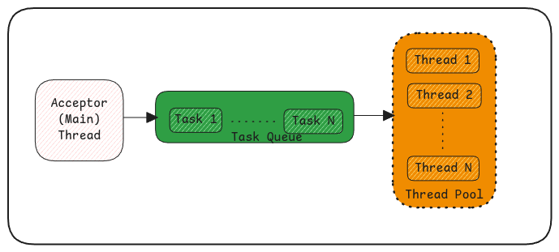

# Threads

In Java, all threads are created during the startup of the application.
This is because creating threads is a resource intensive process.

:::tip[Thread Resources]
Every thread also has memory allocated in RAM
and will remain until the thread is alive.
:::

Threads are created and are in an infinite loop waiting for tasks.

When the main thread of the application receives the request, it just passes the request to the task queue from which the already created threads will pick up the work.

## Inter Thread Communication

Threads can communicate between each other using **static**, **volatile**, **atomic** and **synchronized** concepts.

1. static - Shared variable that can be accessed from multiple threads.
2. volatile - Means the variable is constantly being updated hence must not be read from CPU cache instead from memory.
3. atomic - These are special variables where the update is allowed to be performed only when you pass the previous value and
   if the previous passed value is really the previous known value of the variable. Otherwise the update is rejected.
4. synchronous - A block of code that can be executed by one thread at a time. Other threads are simply paused until then.

:::tip[Important Links]

-   https://dip-mazumder.medium.com/java-memory-model-a-comprehensive-guide-ba9643b839e
    :::
