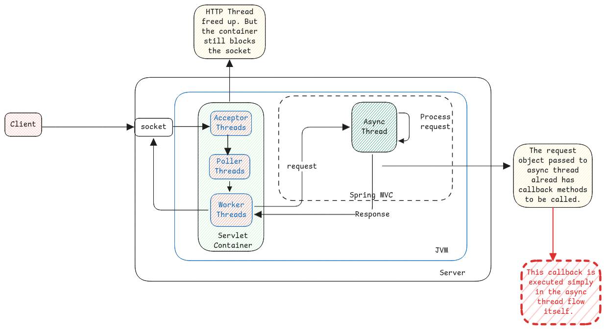

# Asynchronous Servlets

Asynchronous servlets and NIO are related but they're not the same.

:::warning NIO vs Async servlets
NIO is about the acceptor and selector handling multiple IO requests and
the business logic is executed by the worker thread.

Async servlet is about freeing the worker thread.
Here the worker thread offloads the request from itself to threads outside the servlet container.
:::

The entire processing consists of 3 threads.

1. Selector and Worker Thread - Accepts the request from client and hands over the asynchronous thread.
2. Asynchronous Processing Thread - Which does the actual processing of the request.
3. Selector/Poller Thread - Write the response back to client.

It's important to understand that the request servlet thread sends a callback method to asynchronous thread.
The callback method which is on a different **master** thread is then called by asynchronous thread when the
processing finishes and then the **master** thread places a task for the servlet thread pool to pickup
the send response to the topic.

:::tip Spring DeferredResult
Example of asynchronous servlet is the Spring's DeferredResult implementation.
:::

:::info[No change for clients]
There is no difference of the HTTP clients. The socket in which the request came in will remain connected.
It will remain connected until the timeout period.
:::

## Container Threads Creation

The main threads created listener and worker threads at the boot.

## Spring Reactive

In case of normal async servlets, we just offload the task to a thread pool outside of the servlet container.

But in spring reactive, the async process works similar to the **event loop** in NodeJS.
Which means, just one thread handles everything.

## Futures and Completable Futures

This is used for IO, async, parallel tasks which aren't in the context of the web server.
They can be used for any workflow applications, background tasks, etc.

:::info[Interesting Reads]

- [Understanding Servlet 3.0 Async Processing](https://ijunc2.github.io/2018/02/01/seventh.html)
- [Non-blocking I/O Explained Like I'm Five](https://www.codecentric.de/wissens-hub/blog/explain-non-blocking-i-o-like-im-five)
- [Spring NIO Connector vs BIO Connector Overview](https://velog.io/@hyunjong96/Spring-NIO-Connector-BIO-Connector)
- [Spring Reactive and Servlet Async Explained](https://dzone.com/articles/understanding-spring-reactive-servlet-async)

:::
