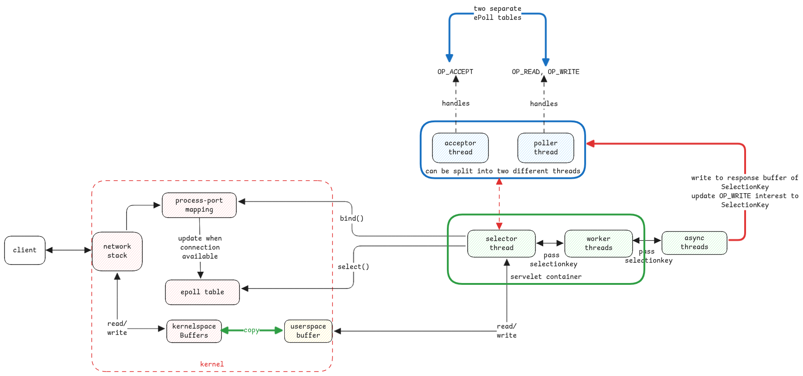

# Blocking and Non Blocking IO

NIO is about not constantly blocking a thread while waiting for any IO to be completed.

:::info[NIO is the default]
NIO is the default way of processing HTTP requests in Apache Tomcat.
This is exactly why we see the thread with name **http-nio-** in Spring Boot
:::

## Blocking IO (BIO)

1. JVM listens on the server port. Eg., 8080. This is the acceptor/main thread.
2. When a request arrives at the this port,
   then main thread then calls the `run` method of the new thread with the **socket** object to a thread.
3. The **Socket Processor** then converts the socket object to an HTTP request object and then calls the servlet.
4. This thread remains blocked until the **complete connection is closed.**
5. If all threads are used up, then no new sockets can be accepted and the client requests hangs.

:::info[TCP is Persistent]
There is always one TCP session used to exchange multiple HTTP messages between clients.
So the thread in the BIO case is blocked by one connection until it's fully closed.
:::

## Non-Blocking IO (NIO)

1. JVM listens on the server port. Eg., 8080. This is the acceptor/main thread.
2. The acceptor thread forwards the socket object to poller queue.
3. Poller then checks/polls the socket for messages.
4. Forwards it to worker thread poll when there is a message.

:::danger misconception of callbacks
All documents speak about **callbacks** used by worker threads to update the response.
There is no callback as such.

The actual objects that the poller thread creates after registering a socket for polling is sent across thread pools.
The worker or async threads simply call the method on these objects which sets the buffer directly on the object
and also update the interest for OP_WRITE event for that **selection key**.
:::

## Working with Kernel Capabilities

### Reading Incoming Data

1. Selector thread creates epoll table in kernel.
2. Asks kernel to update the table whenever there is an OP_ACCEPT event for it.
3. Thread then blocks and monitors if there are any changes in the table.
4. When available, it will accept.
5. This will create a new Socket() object in kernel and also equivalent Java object.
6. We register this new socket object to the epoll table to update when data is available in buffers.
   This is done by updating interest in OP_READ event.
7. Convert the buffer request to the Java HTTP object and also a link to the SelectionKey of the poller.

:::warning namings of interest events
The event of interest here means,
the event in which the selector thread is interested in.
It doesn't mean the selector is changing the state but
only wants to inform kernel to let the application know if the state of the socket changes.
Instead it represents the state of the socket it's interested in.
:::

### Writing outgoing data

1. The worker or the async thread knows when the response has been fully processed and ready to be sent.
2. The final method call basically sets the interest for OP_WRITE event and the buffers with response data.
3. The selector thread is anyways already monitoring for all events.
4. When there is an OP_WRITE event,
   it will copy the data to the response buffers of the connection socket file descriptor object.

:::important copying data between kernel space buffers and userspace buffers
As part of the OP_READ and OP_WRITE,
when these events are received, the userspace applications must use system calls to copy the data from userspace buffers
to the kernel buffers which is then sent out the client
:::

:::tip[Information Sources]

- [Non-blocking IO and Java NIO (cnblogs.com)](https://www.cnblogs.com/kukuxjx/p/18013373)
- [Spring NIO Connector vs BIO Connector Overview (velog.io)](https://velog.io/@hyunjong96/Spring-NIO-Connector-BIO-Connector)
- [Tomcat Networking Model Explained (blog.liu-kevin.com)](https://blog.liu-kevin.com/2022/07/26/tomcatwang-luo-mo-xing/)

:::
