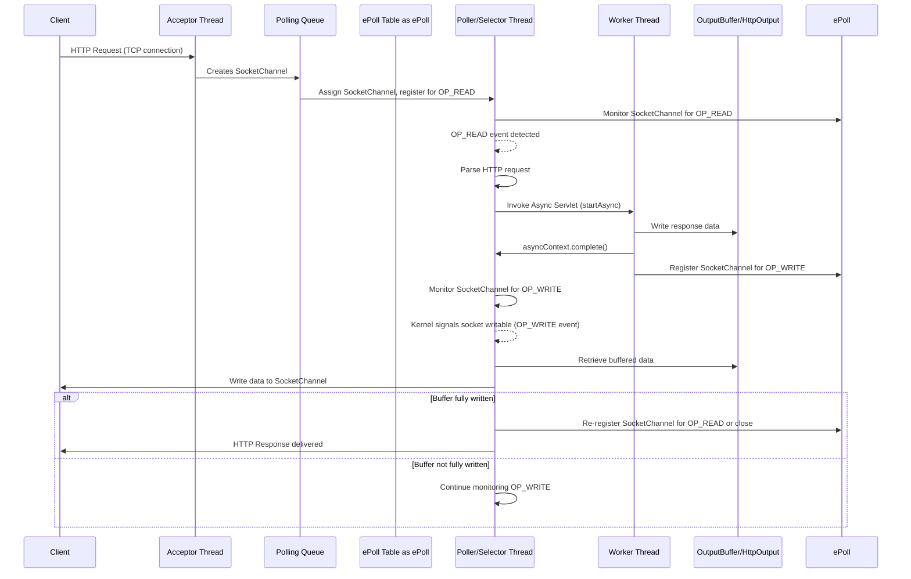

import { ThemeImage } from '@site/src/components/ThemeImage';

# Servlet Containers

Servlet containers are responsible for handling the HTTP requests and responses and
also knowing which Java bean to call whenever a request is received.

It receives the requests and
then runs through the HTTP filters and
then calls the actual Java class/method which will handle the request.

<ThemeImage src='/img/java-webserver-servlet.excalidraw.png' alt='servlet-container' />

:::tip Servlet containers vs HTTP Servers
Plain HTTP servers only implement HTTP protocol and even serve only static content.

Whereas servlet containers can serve dynamic content.
:::

## Convert HTTP to Java Objects

In case of tomcat, the web server converts the raw HTTP request data into structured Java object.

This includes extracting headers, session, parameters and request body.

## Using epoll in Servlet Containers



## Relation Between Java and Kernel Objects

```java

import java.nio.channels.*;
import java.net.InetSocketAddress;
import java.nio.ByteBuffer;

public class NioServer {
    public static void main(String[] args) throws Exception {
        // Create a Selector
        //creates an epoll table - epoll_create()
        Selector selector = Selector.open();

        // Create and configure ServerSocketChannel
        ServerSocketChannel serverChannel = ServerSocketChannel.open();
        serverChannel.bind(new InetSocketAddress(8080));
        serverChannel.configureBlocking(false);

        // Register ServerSocketChannel with Selector for OP_ACCEPT
         // adds the created channel to the created epoll_create() table and tells about the events that are useful for it.
         // this means its ready to be accepted. Inform any channels that are ready to be accepted.
        serverChannel.register(selector, SelectionKey.OP_ACCEPT);

        while (true) {
            // Block until at least one channel is ready
            // calls the epoll_wait() method to wait until an event occurs.
            selector.select();

            // Process ready channels
            for (SelectionKey key : selector.selectedKeys()) {
                if (key.isAcceptable()) {
                    // New client connection
                    ServerSocketChannel server = (ServerSocketChannel) key.channel();
                    // creates new FD for the accepted channel. Its moved to a different FD.
                    SocketChannel client = server.accept();
                    if (client != null) {
                        client.configureBlocking(false);
                        // Register client SocketChannel for reading
                        // Now register this to the selector when its ready for reading.
                        client.register(selector, SelectionKey.OP_READ);
                        System.out.println("New client connected: " + client.getRemoteAddress());
                    }
                } else if (key.isReadable()) {
                    // Data available to read from a client
                    SocketChannel client = (SocketChannel) key.channel();
                    ByteBuffer buffer = ByteBuffer.allocate(1024);
                    int bytesRead = client.read(buffer);
                    if (bytesRead == -1) {
                        // Client disconnected
                        client.close();
                        System.out.println("Client disconnected");
                    } else if (bytesRead > 0) {
                        buffer.flip();
                        System.out.println("Received: " + new String(buffer.array(), 0, bytesRead));
                        // Echo back to client
                        client.write(buffer);
                    }
                }
            }
            // Clear processed keys
            selector.selectedKeys().clear();
        }
    }
}
```

:::tip useful resources

- [What's Web Context & Request Lifecycle in Spring Application (linkedin.com)](https://www.linkedin.com/pulse/what-web-context-request-lifecycle-spring-application-ali-pty1f/)
- [What's Apache Tomcat Server and How Does It Work? (logicmonitor.com)](https://www.logicmonitor.com/blog/what-is-apache-tomcat-server-and-how-does-it-work)

:::
