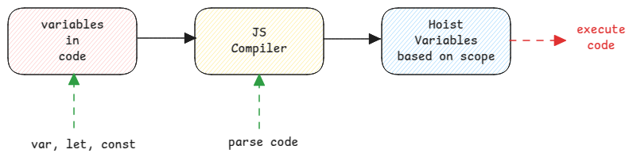

# Hoisting

It's a JavaScript specific concept where the variable and function declarations are automatically moved up by the compiler.
This is exactly why JS still doesn't throw errors when using 'var' variables before it's declaration.

:::tip Meaning of the word hoisting
This is exactly same as flag hoisting where a flag is pulled up.
Similar to that, here the variables are pulled up in their respective scopes.
:::

## Hoisting depends on scope of the variable

During hoisting, all variables are hoisted to the highest possible point based on their scope.

- **var** - block variables are hoisted to function or global depending on whichever is it's parent.
  **No pure block level scope for var** even though the language syntax allowing declaring var variables inside a block.
- **let** - all variables are hoisted within its scope level.
- **const** -all variables are hoisted within its scope level.

## Actual hoisting only for var

Actually the hoisting happens for variables declared with **var** keyword only.
For rest, the lexical environments are created as it is.

This also is because **Var** keyword existed from day one of JavaScript whereas **const** and **let** were introduced later.

:::info Hoisting example

```js
function example() {
    var a = 1; // Function-scoped
    let b = 2; // Block-scoped to function body
    {
        var c = 3; // Function-scoped (ignores block). Will be moved to top of the function.
        let d = 4; // Block-scoped to inner block
        console.log(a, b, c, d); // 1, 2, 3, 4
    }
    console.log(a, b, c); // 1, 2, 3
    console.log(d); // ReferenceError: d is not defined. Error during execution.
}

example();
```

:::

## Default value assignment

Only in case of **var**, the variable is hoisted and also a default value is assigned,
which means it's moved to the top most location in their respective scopes and an 'undefined' is assigned.

Where as **let** and **const** is hoisted but no value (not even undefined) is assigned.
So accessing anything before assignment will throw exception in runtime.



:::danger Lexical Environment and Hoisting
Hoisting is nothing but the creation of lexical environment.
The compiler just pulls up the variables to its corresponding lexical environment map where it belongs to.
:::

## Block Scope

In JavaScript, block scope is any code within flower brackets. But **not** functions.

:::info Block scope examples
if, for and while loops, closures, etc.
:::

## Functions

All functions are also hoisted and added to the corresponding lexical environment.

:::warning Not for functions assigned to variables
If functions are assigned to 'const' variables, then the hoisting works according to **const** rules.
This basically means, the function can't be executed until the variable is really referenced to the function definition.
:::
