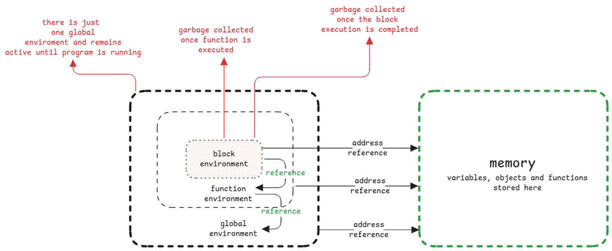

# Lexical Environment

:::tip Meaning of the word lexical

Lexical means the words or vocabulary in a language.
In case of JavaScript, it means the names known to a specific code block.
:::

Lexical environment is a map of all variables and functions known at each level.
At the first step of execution,
the runtime creates lexical environments for each scope for all the code that's part of the execution.

The lexical environment contains all variables and
functions known to each level and the reference to the map object of the parent environment.

:::warning Initial Environment Values
**Functions** - Full value of the function is stored.

**var** - undefined. Value assigned when the assignment code is executed.

**let** - locked in TDZ. Not accessible at all until value is assigned.

**const** - locked in TDZ. Not accessible at all until value is assigned.
:::

The values in the map of the lexical environment entries are just **memory addresses for the values**.

1. Global environment - created when the program starts. Eg., when browser starts.
2. Function environment - created each time the function is executed.
3. Block environment - created each time the control passes through a block.

:::danger Lexical Environment and Hoisting
Hoisting is a conceptual outcome of how lexical environments are built and populated during the compilation/creation phase.
:::
