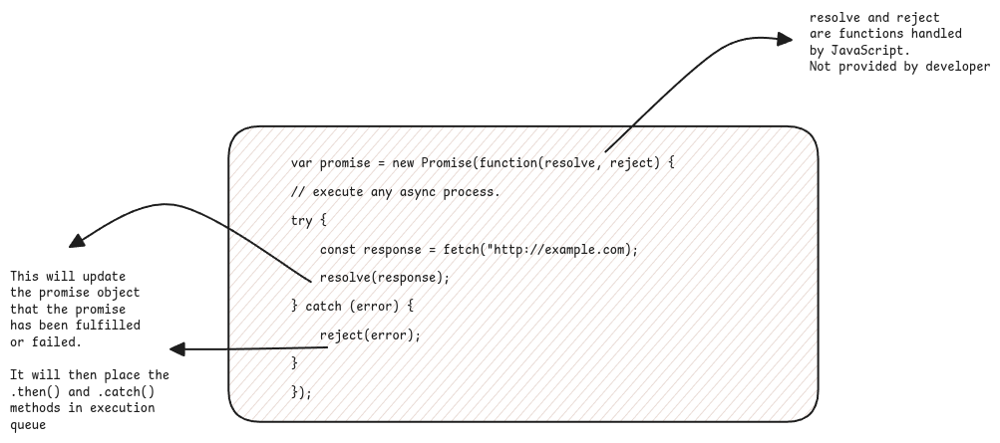

# Promises

:::danger[Important Terms in Promise]
resolve, reject, then, catch, async, await.
:::

Promise is in JavaScript is nothing but the CompletableFuture in Java.

This is used to start asynchronous processes and then we tell the executor about the functions that must be executed
when the execution of this asynchronous process is completed.



## resolve and reject

A Promise constructor takes one object - _executor_ which is the function that must be executed in asynchronous mode
and this _executor_ must have two functions - _resolve_ and _reject_ as parameters.

:::important[Language Specifications ]
Promise object structure is included in the JavaScript specification.
Any implementation of JavaScript must have a constructor described as above.
:::

These are private methods are executed by the engine when the executor function is successful or has failed.
It then sets the internal properties of the Promise object to reflect the state of the execution and
also stores the result object.

:::danger[System Functions]
_resolve_ and _reject_ are **system** functions. These functions are named by the language specification
and executed by any JavaScript engine which implements the Promise requirements correctly.
:::

## then and catch

After the promise is resolved or rejected, then the functions in **then** and **catch** are called
with respective parameters.

:::tip[Trigger Callbacks]
The _then_ and _catch_ callbacks are automatically placed in the callback queue by the JavaScript engine as soon as the state of the Promise has changed.
:::

## async and awaits

Functions marked as _async_ returns a _Promise_ object.
Basically this is done without having to call `new Promise()` constructor.

```javascript
async function f() {
    return 1; // can be anything. Need not be a real asynchronous function such as setTimeout() or fetch().
}

f().then(alert); // 1
```

_await_ statement makes JavaScript wait until the promise is settled and returns its result.
Basically this gets the resolved value from a _Promise_ object without using a _then_.

We can use a regular _try-catch_ block to get the rejected value from the _Promise_ object.

:::warning[Syntactic Sugars]
async-await is more of a syntactic sugar to promise-then-catch. It makes the code more readable.
:::

## Promise.resolve() and Promise.reject()

These are static helper methods which return a _Promise_ object but with the state and value of promise already updated.

This is useful certain cases where the method should always return a Promise but there is actually no task to perform.
For example when we want to return something from a cache but the method's return type is always a _Promise_.

:::tip[Caching Example]
Always using the caching reference to understand the usage of the static helper methods.
:::

:::info[Useful Links]

-   https://medium.com/@lydiahallie/javascript-visualized-promises-async-await-a3f1aad8a943
-   https://stackoverflow.com/questions/31324110/why-does-the-promise-constructor-require-a-function-that-calls-resolve-when-co/31324439#31324439
-   https://stackoverflow.com/questions/54723849/why-and-when-to-use-promise-resolve
    :::
