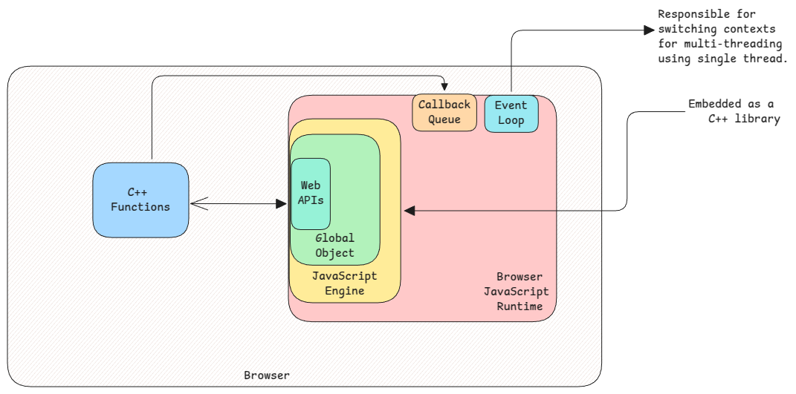
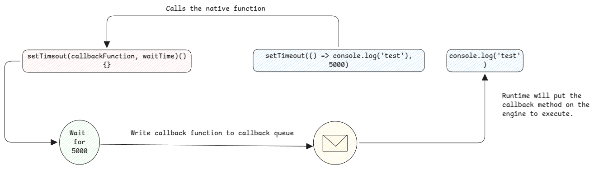

# Runtime

## Engine and Runtime

JavaScript has two parts. One is the **engine** and other is the **runtime**.
The engine is just the code parser, compiler and executor whereas runtime is the combination of engine plus other libraries and components (such as event loop)
which make the JavaScript really usable.

The web APIs here are the APIs of the browser.
They're registered into the global object of the JavaScript engine.

:::warning[DOM]
DOM object is also inside the browser engine. It's not part of JavaScript.
JavaScript only has access to the browser's methods which can then manipulate the DOM object.
:::

## Embedded Library

Coming from a Java background it's hard to understand how JavaScript runtime work.
The mental modal doesn't fit to everything else what I have learnt until now.

The most important understanding to keep in mind is, JavaScript engine is added as a library in other applications
and the runtime is provided by the application which is embedding the JavaScript engine.

1. Browser - JavaScript engine is added into browser's C++ application.
2. NodeJS - JavaScript engine is compiled into NodeJS's C++ application.

:::important[Embedded Library]
This is same as maven libraries in Java. They're just added into the main application.
Main application then hands over requests to JavaScript engine.

And the main application also provides callback queue, event loop and other features (which form the runtime)
to schedule/execute code in JavaScript engine.
:::

### JavaScript in Java

To increase the understanding of how the embedding works, it's very helpful to see how JavaScript runtime in Java works.

Using these libraries, we can see how Java adds Java based functions to the JavaScript's global object and
it's executed when the function is called from JavaScript.

:::tip[Method Execution]
The confusing part here is that the functions called by JavaScript are backed by the applications that are embedding JavaScript.
This means, JavaScript is to write code easily for the caller. But what the called method does is backed by other languages.

In case of browser, methods such as `setTimeout` or `fetch` are written in C++ and they're executed by the C++ code directly.
:::

## Callback Execution Flow

## Native Methods

These are the methods written in programming language that's embedding JavaScript engine into it.
In case of Java, the SDK encapsulates all low-level integrations and provides us easy APIs to work with it.

In case of JavaScript, the logic is the same. All complex methods are implemented in the language which is hosting the runtime.
We can call them directly from JavaScript engine and it gives the user an illusion that the methods exist within JavaScript runtime.

## Event Handlers

An HTML element is also a JavaScript object of type HTMLElement.
When we add an event handler to an element, it only creates a property of type **function** to that object with the provided name.

So when the event handler is executed, the function of that HTMLElement object is executed.

:::info[Useful Links]

-   https://eclipsesource.com/blogs/2015/06/06/registering-java-callbacks-with-j2v8/
-   https://eclipsesource.com/blogs/tutorials/getting-started-with-j2v8/
-   https://www.caoccao.com/Javet/tutorial/advanced/java_and_javascript_interop.html
-   https://dev.to/rahmanmajeed/javascript-the-runtime-environment-35a2
-   https://stackoverflow.com/questions/68325731/how-do-the-render-engine-and-javascript-engine-communicate-in-a-browser
-   https://codingnomads.com/javascript-runtime-environment-browser
    :::
