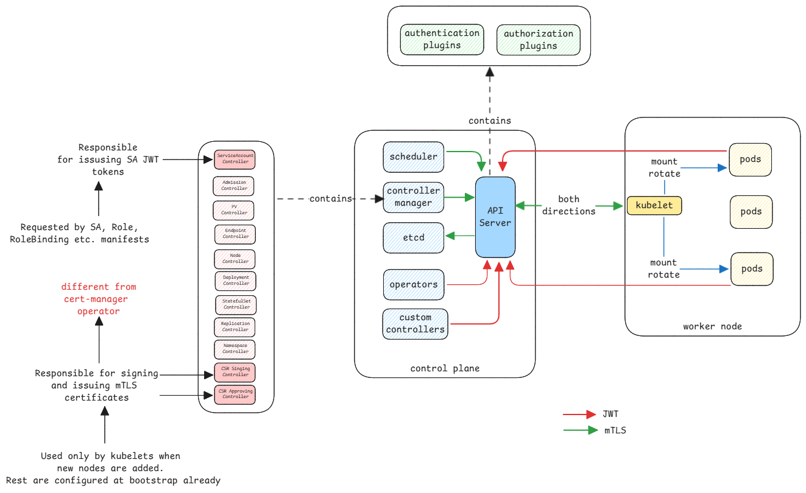

# Auth

Kubernetes has two types of authentication and authorization by default.

1. **mTLS** - This authentication type happens only between the core components of the Kubernetes cluster.
   The cluster contains a cluster wide CA which is created during the cluster installation.
   This follows the same process as browser and web server.
   The certificates and it's content is verified and validated using public keys.

2. **Service Accounts** - This authentication type is for non-core components that are running in the cluster.
   Here the JWT tokens are issued once and can be used by the component to interact with the API server.
   These tokens are then sent in the **Bearer** header from the application using it.
   The API server only validates if the bearer token is really valid.

    This is similar to what happens in OAuth process.
    The server receives the token in the client request.
    The server then sends the token to the Auth provider to check if this is valid.

    :::tip Service Accounts are for services
    It's important to understand that service accounts are accounts for services running in the cluster.
    They're just machine accounts.
    :::

:::danger New process for service account
Since recent versions, the JWT tokens are short lived.
The tokens provided have a default lifetime of just one hour.
The kubelet on the node hosting the pod is responsible for requesting new tokens and update it in the pod.
:::

:::tip Service account example
If an application wants to watch for changes of a specific resource via API server,
it must first request for a service account which is then directly mounted into the requested pod.

The application inside the pod then already knows where to find it's token at the standard location.
Then use it for all the Kubernetes API server calls.
:::

## Authorization

Both mTLS and service accounts have their subjects in the certificates and JWT tokens respectively.
The authorization module then uses this subject name to get it's roles to perform RBAC.

:::info storage for subject to role mapping
This information about subject to roles is also stored in etcd of the cluster.
:::

## Integrations to vault

In case of applications running inside a pod and would like to get secrets from vaults such as HashiCorp vault,
then the service account token can be used for this purpose.

1. Application uses it's service account token to authenticate to the vault.
2. Vault validates the token with the API server of the cluster.

:::important role of vault in validation
Vault doesn't directly validate the token.
It sends the token to the API server of the cluster to validate if it's really valid.
:::
