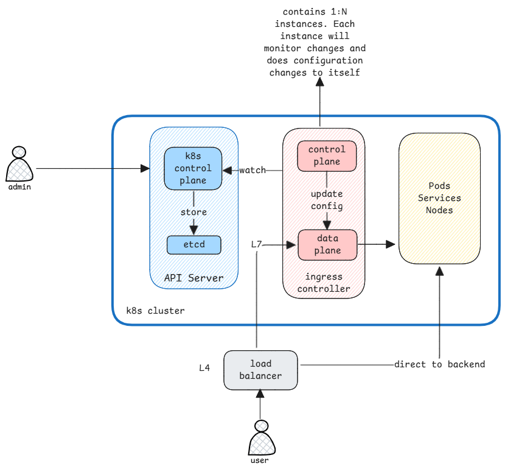

# Ingress

It's always confusing to me the difference between resources of type **ingress** and **load balancer**.

- **ingress** - handles L7 routing **within** the cluster.
- **load balancer** - handles L4 routing **to** the cluster.

## Different types of Kubernetes resources

Ingress is a separate kind whereas LoadBalancer is a type of **Service**.

A Kubernetes service is anything that's used to reach a set of pods.
It can be a load balancer, a cluster IP or a node port.
This is always a L4 based routing.
Whereas an ingress is a separate resource that defines rules for
routing external HTTP/S traffic to services within the cluster.
This is always a L7 based routing.

:::warning difference Kubernetes resource types
Ingress is a separate kind whereas LoadBalancer is a type of Service.
:::

## Overlap Implementations

What's more confusing is some Ingress controllers also create load balancers.

For example, when you create an ingress resource in a cloud provider like AWS or GCP,
the ingress controller will also create an external load balancer to route traffic to the cluster.

:::danger overlap and differences in implementations
In case of cloud providers,

- Ingress controller runs inside cluster but creates the resource of type LoadBalancer outside the cluster.
- Even though it's only an Ingress resource created,
  the controller creates an external LoadBalancer service to route traffic to the cluster.
  :::

:::tip Understand the controller implementation
To clear this confusion, we must see what the Ingress controller implementation is doing.
Check what changes does it implement when an Ingress resource is created.
:::
