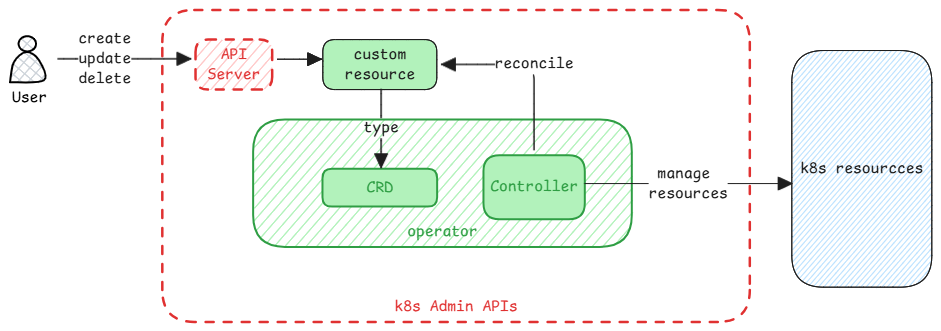

# Operators

An **Operator** is an idea where software is used to manage applications and services.
It provides a ways to automate deployment, upgrades, scaling, backup, etc.

:::important Why the word operator?
Operators in general are people who work in IT operations.
They manage the complete lifecycle of applications and services.

In Kubernetes, these are just software programs that **act as physical operators**.
:::

## Parts of Operators

1. **Controller** - This is the main admin software that runs inside a Kubernetes cluster.
   It continuously monitors the state of the cluster and makes changes to ensure that the desired state is maintained.
2. **Custom Resource Definitions (CRDs)** - These are extensions of the Kubernetes API server
   that allow users to define their own resource types.
   They're the API objects added to the Kubernetes cluster.
3. **Custom Resources** - These are instances of the CRDs that represent the desired state of the application
   or service being managed by the Operator.
4. **Reconciliation Loop** - This is what the controller software does.
   It continuously monitors the custom resources created by the user and compares them to the actual state of the cluster.
   If there are differences, then the controller executes the necessary steps to update the actual state of the resources.

:::tip useful link
[Idea of operators - CoreOS](https://www.redhat.com/en/blog/introducing-operators-putting-operational-knowledge-into-software)
:::
