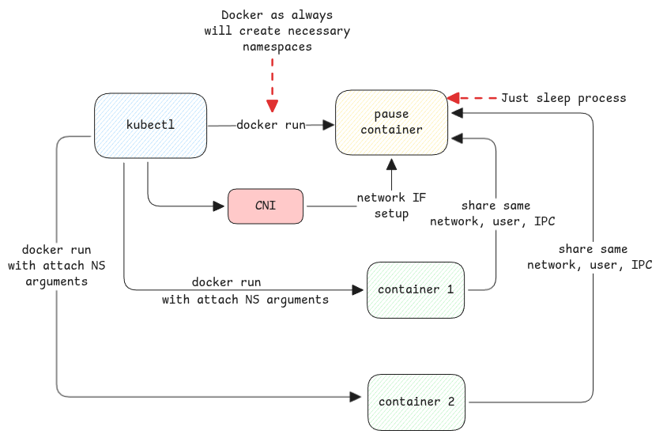

# Pause Containers

We understood in the [namespaces](../linux/namespaces.md#examples) that Kubernetes pods only have certain namespaces.
When kubelet receives a request for a pod, it will create one **dummy** container with necessary isolated namespaces.

Then the CNI will setup connectivity from this isolated network namespace to the host.
This is what's used by all containers that are connected to this logical group.



:::info docker run with arguments
Docker provides a way to start containers where it can join other container's namespaces.

```sh
docker run --name k8s_app_my-pod \
  --network container:k8s_POD_my-pod \  # Join pause's network NS
  --ipc container:k8s_POD_my-pod \      # Join pause's IPC NS
  --pid container:k8s_POD_my-pod \      # If shareProcessNamespace
  --volume /var/lib/kubelet/pods/.../mount:/data \
  my-app-image
```

:::

## Why we need this?

1. If the main containers itself own the shared namespaces,
   then if one container fails then the other containers are also broken.
2. We will have to maintain sequence of container startup.
3. Any container restarts will destroy the namespaces.
