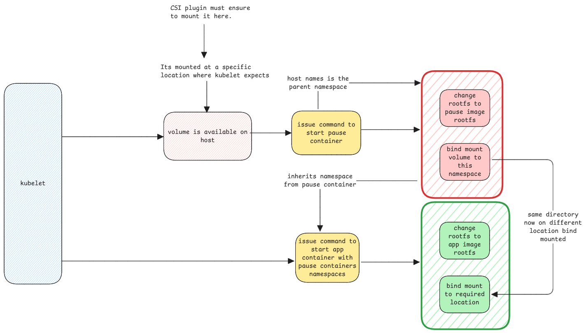

# Pods

Have always had a misconception that a Kubernetes Pod is something that encloses one or more containers.
This isn't true.

A pod is just purely a logical. It doesn't exist at all.
Only thing that exists is the [pause container](pause.md) container
which is what the kubelet creates as the root of the pod.

## Preparation

Pod preparation is similar to [container preparation](../containers/isolation.md#container-creation-process).
The main difference is, it first creates the pause container with all necessary namespaces and
then create the actual containers using the pause container namespaces.

## Pod information in manifests

Manifests contain two sets of information.
One for the entire pod and rest for the app container.
This entire pod information is what's used to configure the pause container.

:::important PVC and Volume Mount
This is exactly why the PVC information is at the pod level since the PVC must be prepared
and made available on pause container.
The volume mount is at the main container level since it will be then mounted
from the mount namespace created together with the pause container.
:::
