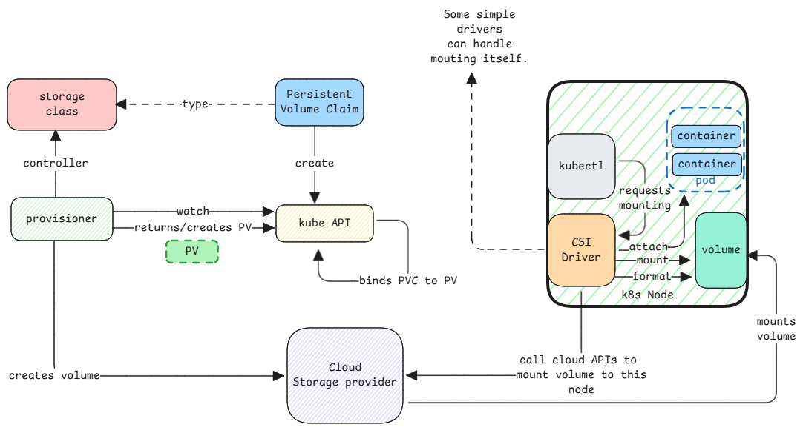

# Storage

In Kubernetes, storage has multiple concepts which represent the entire storage lifecycle.

1. **Provisioner** - Main controller which handles provisioning of storage.
   It handles creating of storage on the underlying infrastructure.
2. **Driver** - It's the controller that implements the Container Storage Interface (CSI) specification.
   It's running on each node and is responsible for mounting and un-mounting volumes to/from nodes.
3. **Storage Class** - Represents different types of storage available.
   Depending on storage class requested, different provisioners will handle the request.
4. **Persistent Volume Claim** - Request for storage by a user.
5. **Persistent Volume** - Actual storage resource created on the infrastructure.
   Every persistent volume claim will be bound to a persistent volume.
6. **VolumeClaimTemplate** - Used in StatefulSets to create a persistent volume claim for each pod.

:::warning PVC vs VolumeClaimTemplate
When we've a deployment with 3 replicas,
we can use a single Persistent Volume Claim (PVC) to request storage for all 3 pods.

But in case of StatefulSets, we need to use a VolumeClaimTemplate.
In this case, each pod will get it's own Persistent Volume Claim (PVC) using the requested template.
:::

:::important PV is dynamically created
When a Persistent Volume Claim (PVC) is created, the Provisioner dynamically creates a Persistent Volume.
The user need not create a Persistent Volume (PV) manually.

In cases where the storage provisioning isn't automated,
somebody will have to create the storage manually and
then create the physical volume, PV and
link it to the PVC.
:::

## Storage Class

This is similar to what we saw in [ingress](ingress.md).
Every storage class represents a different provisioner.

:::info Default storage class
Every cluster has a default storage class.
Every PVC created without specifying a storage class will use the default storage class.
:::

## Access Modes

Storage access modes defines what kind of access is required for the volume.
It's the storage class and the access modes which determines the provisioner that will handle the request.

:::info Access modes are for Nodes
Access modes aren't for Pods. It's at node level.

For example, if a volume is mounted on a node in ReadWriteOnce mode,
then it's mounted on a single node and all pods on that node can access it.
But if we use the RWOP mode, then the volume can be also used by only one pod at a time.
:::
