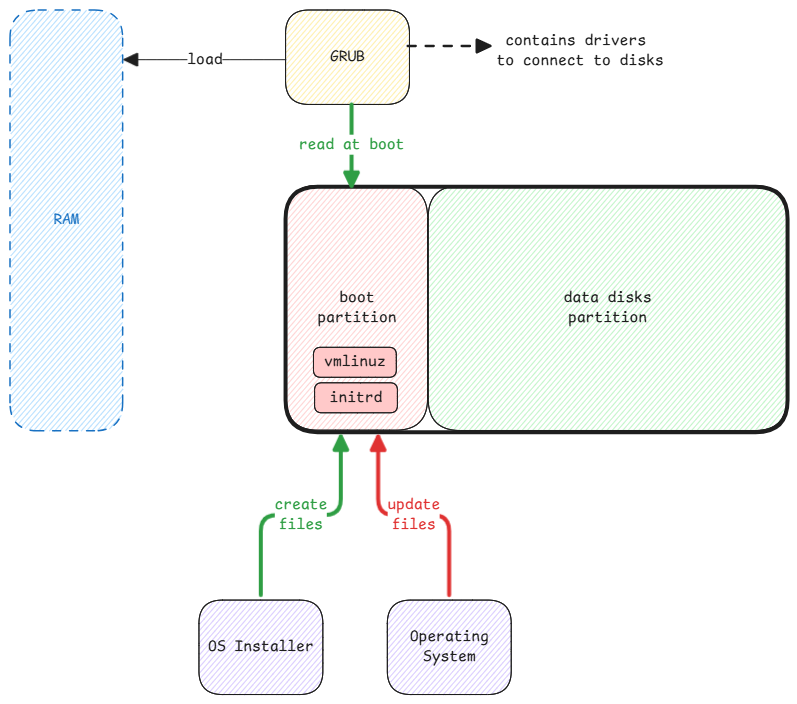

# /boot directory

**/boot** folder contains the kernel file (vmlinuz) and initramfs (initrd) files.

During boot, GRUB reads the MBR and knows which partition is bootable
and what's the filesystem type, etc.

GRUB has inbuilt minimal filesystem drivers such as EXT4, FAT, etc.
It uses it to load it into the memory.

After boot, this location on disk is **mounted and displayed** as **/boot** filesystem.
It's done just to ensure updating these files during upgrade, etc.

:::important /boot is accessed from both places
From GRUB for loading the kernel and initramfs into memory during boot
and from userspace application to upgrade or change these files.
:::

## Contents

It contains not only the kernel and initramfs files,
but also files related to GRUB which is [also read during boot](./grub#application-storage).

