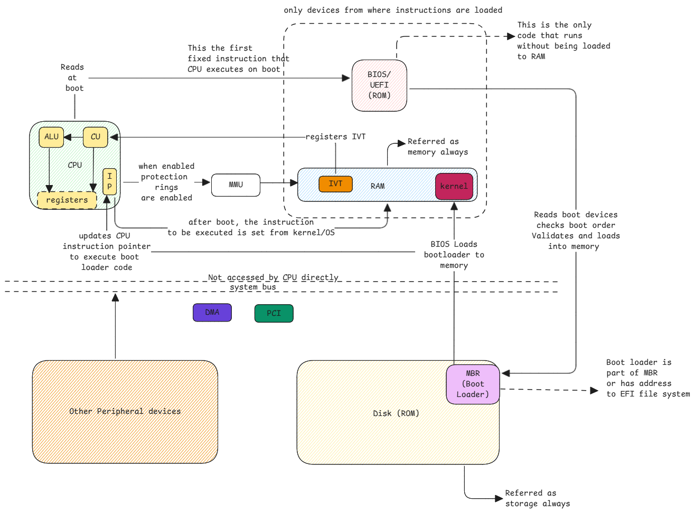

# Boot Process

All a CPU can work on is the instructions that are supported by its instruction set.
Only thing that matters is, who controls which instructions are executed.

## What happens at boot

Only at boot, CPU executes the instructions from a pre-determined address which is the BIOS.

After that, BIOS loads the bootloader into the memory and then CPU executes the bootloader.

After that the kernel is loaded by the bootloader into the memory and CPU starts to execute it.
Then kernel takes over the control of CPU and executes its instructions and initializes devices and
then makes the system ready for userspace applications.

:::important memory means RAM only
When we say memory means only and only RAM.

ROM and disk devices are always referred as storage.
:::

## First steps after boot

kernel loads [initramfs](./initrd.md) and executes the /init script inside it.

:::warning hardware detected and drivers exist
Kernel recognizes hardware and loads all drivers at the boot.
It only hands over to initramfs after these steps are completed.

When initramfs is loaded, it also looks for a standard location for the drivers
and loads from there as well.
:::
