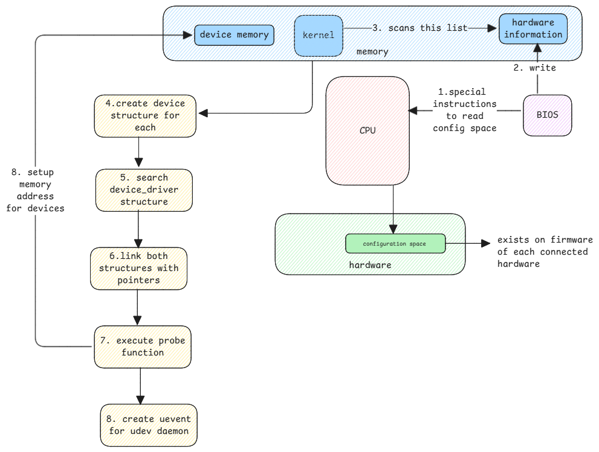
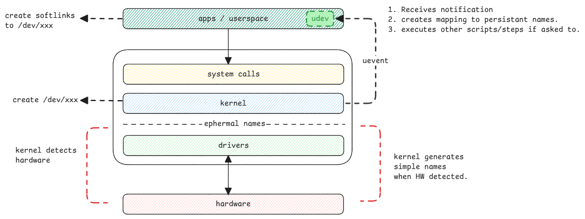

# Device Manager

Device managers in Linux isn't similar to Windows where we've one single tool that manages all devices.
In Linux, there are different tools that manages different types of devices.
Some handle block devices, some handle USB devices, some handle PCI devices, etc.
Here we see how devices are represented in the kernel, how they're registered,
and how userspace interacts with them.

## Software Representation

1. struct `device` - This is the core structure that represents a device in the Linux kernel.
2. struct `device_driver` - This structure represents a driver that can handle a specific type

:::important link between device and driver
both these structures are linked together using a `struct device_driver` pointer in the `struct device`
and vice versa.
:::

## udev

**udev** is short form for userspace device manager.
It defines the following for each device.

It configures the device in the userspace and let's userspace applications interact with the device.
It additionally executes whatever steps needed to be done when a device is added or removed.

:::tip example of udev task

1. When a printer is added, udev can be configured to execute scripts which will
   automatically add this printer to the printer list.
2. Pop-up notification when a USB device is added.
3. Network configuration scripts such as DHCP in case of sockets.
   :::

## Ephemeral vs Persistent Namings

Kernel uses ephemeral names for devices, which aren't persistent across reboots.
It gives names in the sequence the BIOS has detected the devices.

But these are simple names for kernel to handle,
whereas userspace applications need persistent names to identify devices across reboots.
This is where udev comes into picture.

:::warning in-built versus external drivers
When a driver isn't part of the kernel itself, but is loaded as a module.
Where as external drivers are loaded as modules.
:::

## Loading Persistent Information

In case of a disk, the UUID is read from the disk and used as the persistent name.
In case of a network interface, the MAC address is used as the persistent name.

For other devices, hardware information such as vendor ID, product ID, and serial number are used to create a unique identifier.

These values remain same across reboots and are used to identify the device in the userspace.
This is then mapped to the ephemeral name given by the kernel in the **uevent** message.

All userspace applications use this persistent name to identify the device.

:::danger /dev is a temporary filesystem
It's important to note that `/dev` is a temporary filesystem,
which means that the devices listed in `/dev` aren't persistent across reboots.
Each time the system boots,
the devices are re-detected and the `/dev` directory is recreated with the current devices.

But it's important to know that udev ensures the userspace names of devices are kept consistent across reboots.
:::

## Difference between /dev and /sys file systems

Both /dev and /sys are virtual filesystems in Linux to manage devices, but they serve different purposes.

**/dev**:

- Contains device files that represent hardware devices.
- Provides a way for userspace applications to interact with devices.
- Device files are created and managed by udev.

**/sys**:

- Contains information about devices and their attributes.
- Provides a way to access kernel data structures related to devices.
- Used for querying and modifying device properties.

:::tip example of /dev and /sys

- `/dev/sda` is a device file for a disk.
- `/sys/block/sda` contains information about the disk, such as its size, type, and other attributes.
  :::
