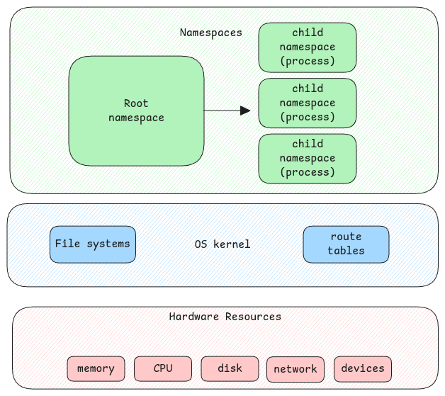

# Namespaces

Namespaces is a concept which provides **process** isolation.
This means, the process which is started with its own namespace has its own set of users,
resources, mount points and may more.

It's a kernel feature where kernel allows userspace applications to run on isolated
environments.

This means, when a process is started,
we can define the namespaces

- user namespace, mount namespace, network namespace, hostname namespace, time namespace, etc
  to be used by the namespace.
  The kernel ensures that the process sees a specific view of the underlying hardware.

:::danger Not all namespaces are mandatory
Not all above mentioned namespaces are necessary when we create an isolated environment.

For example, if a process is started without a mount namespace,
then the process sees the same filesystem that the parent process sees.

In case of docker, it automatically ensures the application process is created
with all necessary namespaces to ensure complete isolation.
:::

## nsproxy struct

As we know every process in Linux has a corresponding **struct task_struct**. See [here.](./processes.md#processthread-structure)

This struct has a pointer to another structure called **struct nsproxy**.
This structure has references to all namespaces objects of the process.

## Standard Streams

When a docker container or when a process with an isolated namespace is started,
the standard streams of these processes are set to the parent process
that's executing the process that's why the output of the
application is seen on the terminal which started the process.

## cgroup

cgroup is short form of control groups.
With cgroup, we can control the amount of physical resources
