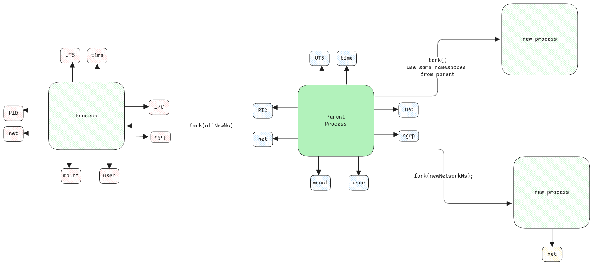

# Namespaces

Namespaces is a logical separation of **processes** provided by kernel.
Every process that's started can be started by specifying 0 or 1-N type of different namespaces.

- 0 means, the newly started process simply inherits everything from the parent PID.
- 1-N means, we can specify another namespace for any of the resources.

:::warning usual misconception
Usual misconception is that, we think the process is started in it's own namespace.
This then makes sure that this process gets it's own PID, mount, net, etc. namespace.
This isn't true at all.

You can simply start a process just **only** with it's own network namespace.
Rest of the namespaces can be simply inherited from it's parent process which started this process.
:::

This means, when a process is started,
we can define the namespaces that we would like to use.
For example, if a process is started without a mount namespace,
then the process sees the same filesystem that the parent process sees.

## Examples

- In case of docker, it automatically ensures the application process is created
  with all necessary namespaces to ensure complete isolation.
- In Kubernetes, Pods have only it's own network, UTS (hostname) and IPC namespace.

## Isolation Levels

Each namespace provides different levels of isolation based on the type of resource.

- PID namespace - this is an hierarchical one.
  So the parent process can still see the process of the child namespace.
- Net namespace - It's completely isolated since network namespaces aren't hierarchical.
  They both communicate with the network hardware two complete separate networks.
- Mount namespace - The entire data on the host is visible to all mount namespaces.
  The mount name space only handles the logical 'view' of the paths on the disk.

:::important mount namespace is for mount points
Mount namespace isn't for disk or file systems.
**Its only for mount points**. This nuance is important to understand.
:::

## How different namespaces are created

Every type of namespace such as PID, network, mount are backed by a specific type of kernel C structure.
When we create a new namespace of a specific type,
a new object of this structure is created and linked to the process's [nsproxy](#nsproxy-struct) structure.

## nsproxy struct

As we know every process in Linux has a corresponding **struct task_struct**. See [here.](./processes.md#processthread-structure)

This struct has a pointer to another structure called **struct nsproxy**.
This structure has references to all namespaces objects of the process.

## Standard Streams

When a docker container or when a process with an isolated namespace is started,
the standard streams of these processes are set to the parent process
that's executing the process that's why the output of the
application is seen on the terminal which started the process.

## cgroup

cgroup is short form of control groups.
With cgroup, we can control the amount of physical resources provided to these namespaces.
