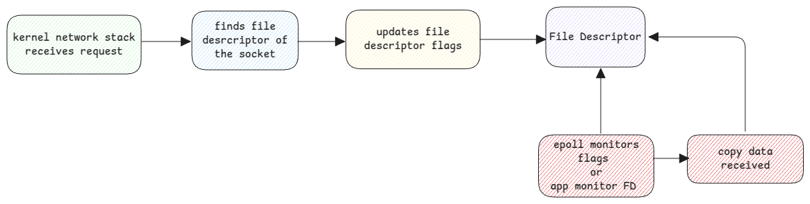

# Sockets

Sockets are C structures which refer to either server accepting network connections or
clients which initiate network connections.

## Socket Multiplexing

Whenever there is an incoming request, the following high-level steps happen.

## Network adapters not listed in /dev

Network interfaces aren't listed under /dev due to its dynamic nature.

This is because network interfaces can be dynamically created, configured, or removed, reflecting changes
in network topology or virtual networking setups.
This dynamic nature doesn't fit well with the static model of device files under /dev.
