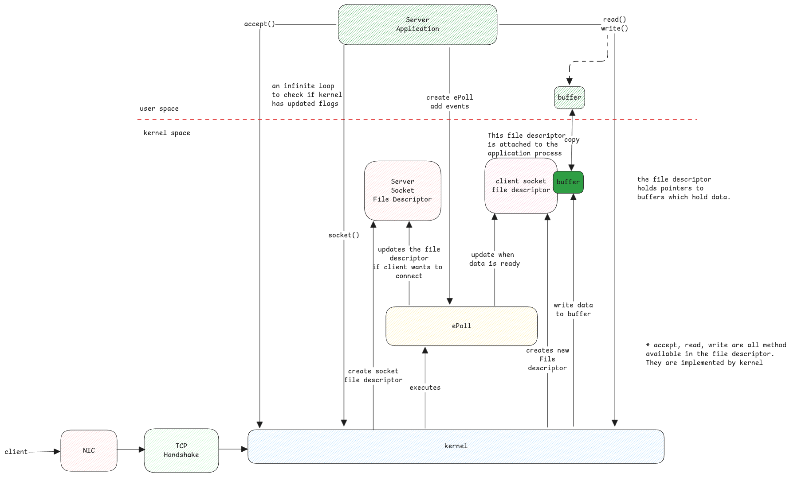

# Sockets

Sockets are C structures which refer to either server accepting network connections or
clients which initiate network connections.

## Socket Multiplexing

Whenever there is an incoming request, the following high-level steps happen.

## Network adapters not listed in /dev

Network interfaces aren't listed under /dev due to its dynamic nature.

This is because network interfaces can be dynamically created, configured, or removed, reflecting changes
in network topology or virtual networking setups.
This dynamic nature doesn't fit well with the static model of device files under /dev.

## Unix Domain Sockets

The socket structures what we speak here is used not only for network communication but also for
inter-process communication (IPC) on the same host via Unix Domain Sockets (UDS).

UDS is exactly same as IP but it uses file system path as address instead of IP address and port number.

:::important Virtual File System (VFS) and Sockets
When ever a socket is created, a **.sock** file is created in the file system.

This file has special kernel methods associated with it to handle read and write.
These methods just read and write data between different memory buffers of two different processes.
:::
