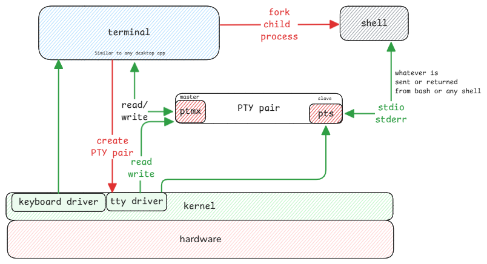

# Terminals

Terminals are desktop applications, just like a browser or any other application.
Similar to how a browser can be used to open multiple web apps,
similarly, a terminal can be used to open multiple apps such as bash, nushell, zsh, etc. or even python REPL.

:::important terminal is what you choose
Terminal software is what you manually choose by starting it.
The default application the terminal starts is the **shell**
and is part of the user configuration.
:::

## Line Discipline

In a terminal, the **line discipline** is the way input and output are handled.

1. When characters are entered, they're displayed on screen but not sent to bash or any program the terminal has forked.
2. When the Enter key is pressed, the line discipline sends the entire line to the program.
3. Terminal also handles special keys like Ctrl+C, which sends a signal to the program to interrupt it.

## Shell doesn't display anything

Whatever you type in the terminal isn't the bash feature.
Terminal just displays whatever events it receives from the keyboard.

:::warning terminal applications needs to know which terminal

Terminal applications such as vim, less, top, etc needs to know which terminal is executing it.
It's necessary since shell generates output and escape characters based on terminals.

It gets the value from **$TERM** and then uses the value to get information from **/usr/share/terminfo**.
:::

Receives input -> displays it on screen -> send to master ->
TTY driver sends it to slave -> slave is connected to bash -> bash reads input from slave.

:::danger shell is deceiving
Even though it looks like Bash is doing all by itself,
it's the terminal which sends the input to the bash process and
displays the output from bash.
:::

## tty command

'tty' command shows which slave device is connected to the current shell.
Each shell knows only its slave device from which it reads input and writes output.

## Terminal Configuration

For every user it's configured in **/etc/passwd** file the default shell.

:::tip remote connection to a machine
When we connect to a machine using SSH,
the terminal is in the local machine and the SSH server creates a bash process on the remote machine.

SSH server creates a slave device for the bash process,
and the SSH client creates a master device for the terminal.
The final process is same just that the slave is in the remote machine and master is in the local machine.
:::

## Terminal Prompt

Prompt is just another **stdout** returned by bash to terminal.
Bash only has a configuration to return a certain string whenever it's ready to accept a new command.

So the same prompt is returned after the previous command is executed.

## oh-my-posh and nerd-fonts

The relation between these projects are exactly what's described above.

1. **oh-my-posh** is a **shell prompt theme engine** that generates the prompt string.
   It only configures the shell to generate prompt with the desired string using Unicode characters.
2. **nerd-fonts** is a collection of fonts that includes additional glyphs and icons.
   The Unicode values returns from the shell prompt is rendered using these fonts.
