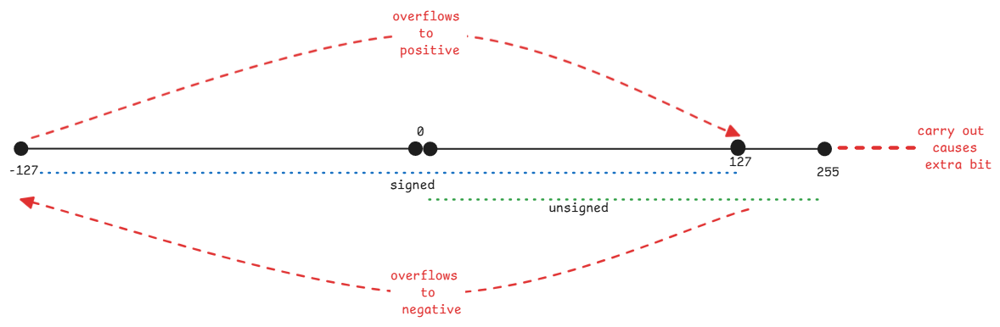

# Binary Arithmetic

Since everything at the assembly level is just binary,
it's important to understand how binary arithmetic works and
how different cases are handled here.

:::important carry-out and carry-in

- **carry-out** is the carry value send out to the next position.
- **carry-in** is the carry value received from the previous position.

This means, what's carry-out for one position is the carry-in for the next position.
:::

## Status Flags

1. Carry Flag (CF) - This flag is set when there is a carry out from the most significant bit (MSB) in addition,
   or a borrow in subtraction. It indicates that the result of an operation exceeds the maximum value that can be represented
   with the given number of bits.

2. Zero Flag (ZF) - This flag is set when the result of an operation is zero. It indicates that the operands were equal
   in a comparison operation.

3. Sign Flag (SF) - This flag is set based on the sign of the result of an operation.
   It reflects the most significant bit (MSB) of the result,
   where 0 indicates a positive result and 1 indicates a negative result.

4. Overflow Flag (OF) - This flag is set when the result of a signed arithmetic operation exceeds the range that can be
   represented with the given number of bits. It indicates that the result is too large or too small to be represented correctly.

:::important RFLAG register
RFLAG register is a single register which contains all the status flags.
Each flag is represented by a specific bit in this register.
:::

## Signed and unsigned calculations

For every arithmetic operation, the CPU provides result of both signed and unsigned operations.
It's up to the caller to consider the output according to it's choice.

So for every operation, CPU will set the result as well as CF and OF flags
considering signed and unsigned operations.

:::tip Java uses only signed
For example, Java has only signed integer types.
So, when Java code performs arithmetic operations, it relies on the Overflow Flag (OF)
to detect overflow conditions in signed arithmetic.
:::

## How hardware detects these flags

**Overflow** - It checks the sign bit of the input values.
If the input is both negative, the output's signed bit can't be positive.
Similarly, if input is both positive, the output's signed bit can't be negative.

**Carry** - Checks directly if the last bit's addition has a carry-out of 1.
For subtraction, it checks if borrow is needed.

## Mental model for carry and overflow

In case of signed numbers, consider the sequence as a ring.
When overflow happens, the result wraps around to the negative side of the ring.
This is also why it's called a **overflow**.

In case of unsigned numbers, consider the sequence as a straight line.
When carry happens, the result exceeds the maximum limit.

:::warning Cases where both carry and overflow happens.
There are some cases, such as specific combinations of negative and positive numbers,
where both carry and overflow can happen simultaneously.
:::

