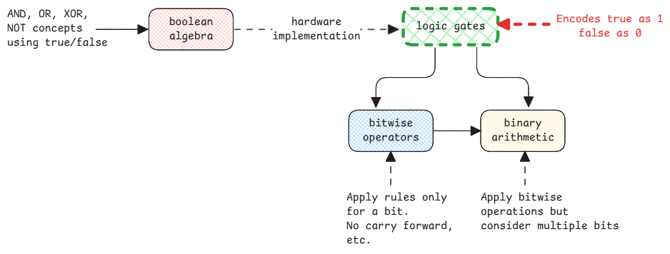

# Boolean Algebra

Boolean algebra is the original theoretical area dealing with only **true** and **false**.
It's this area of mathematics that introduced AND, OR, XOR, NOT etc. concepts for boolean inputs.

This is the basis of bit-wise and [binary-arithmetic](./binary-arithmetic.md) fields.

:::important Boolean to Binary Encoding
This a very important mental model to have.
Binary and boolean aren't same.
It's just that the binary is used to represent boolean values.
:::

## Standard Boolean Operators

| Operator | Symbol | Description                  | Input causing output = True | Input causing output = False |
| -------- | ------ | ---------------------------- | --------------------------- | ---------------------------- |
| **NOT**  | ¬, ~   | Flips the value              | Input = False               | Input = True                 |
| **AND**  | ∧, ·   | True only if both are true   | Both True                   | Any False                    |
| **OR**   | ∨, +   | True if at least one is true | Any True                    | Both False                   |
| **XOR**  | ⊕, ⊻   | True if inputs are different | Inputs differ               | Inputs same                  |
| **NAND** | ↑, ⊼   | Opposite of AND              | Any False                   | Both True                    |
| **NOR**  | ↓, ⊽   | Opposite of OR               | Both False                  | Any True                     |
| **XNOR** | ⊙, ≡   | True if inputs are the same  | Inputs same                 | Inputs differ                |

:::tip different from bitwise operators
Bitwise operators aren't part of boolean algebra.
Normally we refer everything as bitwise operations but they aren't actually.

Bit right/left shift, rotate right/left are bitwise operators.
:::
