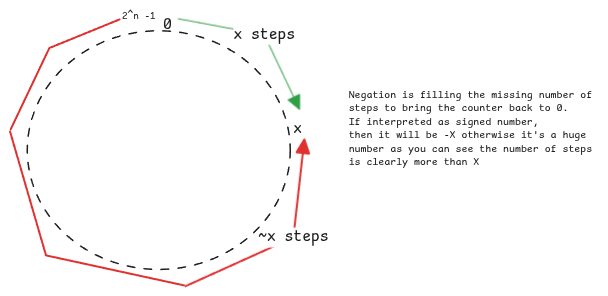

# Boolean Algebra

Boolean algebra is the original theoretical area dealing with only **true** and **false**.
It's this area of mathematics that introduced AND, OR, XOR, NOT etc. concepts for boolean inputs.

This is the basis of bit-wise and [binary-arithmetic](./binary-arithmetic.md) fields.
Computers at the end use different operators in boolean algebra to perform binary arithmetic.

:::important Boolean to Binary Encoding
This a very important mental model to have.
Binary and boolean aren't same.
It's just that the binary is used to represent boolean values.
:::

## Standard Boolean Operators

| Operator | Symbol | Description                  | Input causing output = True | Input causing output = False |
| -------- | ------ | ---------------------------- | --------------------------- | ---------------------------- |
| **NOT**  | ¬, ~   | Flips the value              | Input = False               | Input = True                 |
| **AND**  | ∧, ·   | True only if both are true   | Both True                   | Any False                    |
| **OR**   | ∨, +   | True if at least one is true | Any True                    | Both False                   |
| **XOR**  | ⊕, ⊻   | True if inputs are different | Inputs differ               | Inputs same                  |
| **NAND** | ↑, ⊼   | Opposite of AND              | Any False                   | Both True                    |
| **NOR**  | ↓, ⊽   | Opposite of OR               | Both False                  | Any True                     |
| **XNOR** | ⊙, ≡   | True if inputs are the same  | Inputs same                 | Inputs differ                |

:::tip different from bitwise operators
Bitwise operators aren't part of boolean algebra.
Normally we refer everything as bitwise operations but they aren't actually.

Bit right/left shift, rotate right/left are bitwise operators.
:::

## Arithmetic Negation

Arithmetic negation is the negative number representation of a positive number.
The most important mental model is to think in term of **modular** operation where used the circular based counter.
For counting positive numbers, we move in clockwise direction starting form zero and
for counting negative numbers, we move in the opposite direction starting from zero.

Since $$x + (-x) = 0$$,
negating will always generate the value that when added to the original value
will bring the position of the pointer on the circular ring to zero.
Hence the value of $$-x$$ is always ($$\sim{x}) + 1$$.
The $$+1$$ is needed to ensure the counter comes to zero.

**It's a very important mental model to remember that,
numbers at CPU register level are placed in a circular ring.
Meaning, it starts from 0 and goes up to $$2^{n}$$ depending on the size of the variable.**

:::warning different negations possible

- $$!$$ Boolean NOT. Flips true to false and vice versa.
- $$-$$ Arithmetic negation - Subtracts a number from zero.
- $$\sim$$ Bitwise NOT - Flips every individual bit from 0 to 1 and 1 to 0.
  :::

## Using boolean algebra in bit vectors

Bit vectors are nothing but an array of bits.
In all programming problems, we just use an integer to represent a bit vector
since integers are just a sequence of bits.

:::important bit vectors are very important
Bit vectors are used in many solutions.
It's very useful to understand how data manipulation and extraction in bit vectors work.
:::

:::tip use of **1** as mask
In all the below steps, we **1** as the mask.
This means it's an integer 1 where just last bit is set to 1.
We then use shift operators to move this 1 at different positions.
:::

<!-- markdownlint-disable MD013-->

| Purpose                    | Operation       | Expression            | What it Does            | Mental Model           |
| -------------------------- | --------------- | --------------------- | ----------------------- | ---------------------- |
| **Set a bit**              | OR `\|`         | `x \|= (1 << i)`      | Forces bit `i` to `1`   | “Turn ON this switch”  |
| **Clear a bit**            | AND + NOT `& ~` | `x &= ~(1 << i)`      | Forces bit `i` to `0`   | “Turn OFF this switch" |
| **Toggle a bit**           | XOR `^`         | `x ^= (1 << i)`       | Flips bit `i`           | “Flip the switch”      |
| **Check a bit**            | AND `&`         | `(x & (1 << i)) != 0` | Tests if bit `i` is `1` | “Is this switch ON?”   |
| **Extract a bit**          | Shift + AND     | `(x >> i) & 1`        | Gets value of bit `i`   | “Read this switch”     |
| **Clear lowest set bit**   | AND trick       | `x &= (x - 1)`        | Removes rightmost `1`   | “Drop the last ON bit” |
| **Isolate lowest set bit** | AND trick       | `x & -x`              | Keeps only lowest `1`   | “Find first ON switch” |
| **Create mask**            | Shift           | `1 << i`              | Single bit mask         | “Pointer to one bit”   |
| **Invert all bits**        | NOT `~`         | `~x`                  | Flips every bit         | “Reverse all switches” |

<!-- markdownlint-restore-->

:::tip why $$x-1$$ is important?
$$x-1$$ mentioned above is another concept to remember.
When we minus 1 from any number, it will always toggle all ending zeros to ones and
the first available 1 to 0.
Then performing an **AND** between these two values will operate on the rightmost 1 bit.
:::

:::tip what $$x\&-x$$ means?
Important nuance to keep in mind is,
between x and -x the bits are same until the first/lowest 1,
after that all bits are opposite between x and -x.
:::

:::danger whats the variable in bit shift operators
It always means the **number of times** the bit sequence must be moved left or right.
Or other way to look at it's, to say move the bit at that **index** position to $$0^{th}$$ position.
:::

:::warning smallest mental model to remember

- OR - sets a specific bit to 1.
- AND - sets a specific bit to 0 (but the mask must be 0 at that position and 1 at rest.)
- XOR - Changes 1 to 0 and 0 to 1.
  :::

:::important checking vs extracting

- Checking returns boolean - true or false.
- Extracting returns actual value - 0 or 1

It's important to know this distinction.
:::
