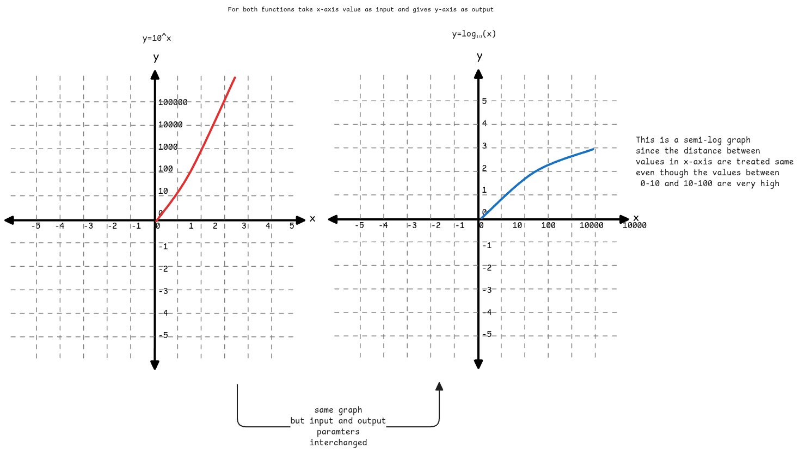

# Logarithms

It's a mathematical concept used for describing different things.
It gets confusing since it's used at multiple places for different purposes.

:::tip Meaning of word **Logarithm**
The word 'Logarithm' is derived from two Greek words: Logos and Arithmos.

- Logos here means rational, logic, or ratios.
- Arithmos means numbers.

It makes sense to see logarithm as something that adds meaning/logic/structure to a sequence of numbers.
Example, when we see sequence of population growth numbers,
logarithm helps us to understand the growth rate in a better way.
:::

```sh
# A logarithmic expression is written as below.
# Where base is 2 in this case. Which means the value doubled at each step in case of exponential
# and halves in case of logarithm.
log₂(x) = y
```

:::important how to read the expression
Think of it as a function name.
We pass the original value **x** to it and we get the logarithmic value **y** from it.
:::

:::danger mental model for logarithms
For any sequence of numbers where the values are generated by multiplying the same number again and again,
such number sequences can be represented by logarithms.
It's just **multiplication** of the logarithm's base number with a specific **N** value to get the actual number.
This N can be anything from 0.
:::

## Inverse of Exponential

Similar to how inverse of addition is subtraction,
inverse of multiplication is division,
in the same way, inversion of exponential function is logarithmic function.

:::warning Logarithm in big O notation
This is exactly why logarithmic functions are used to describe process where value reduces at each step.

For example, in case of base 2,

- exponential - Value doubles at each step.
- logarithmic - Value halves at each step.
  :::

```sh
2ʸ = x
log₂(x) = y
```

:::info number of steps to reach original number
In the above two functions,
we can see that logarithm helps us to figure out how many times the base must be multiplied to get original number.
So even for exponential growth, logarithm helps us to find how many steps it took to reach that value.

Because logarithm of gives the number of times the base must be multiplied to reach the original number.
:::

## Graphs



## Important use cases

1. Very large values can be shortened and represented using logarithmic functions.
2. Represent exponentially growing sequence of values by inversing it to get a linear sequence of values.
3. Helps to understand growth rate of exponentially growing values.
   This is where we see how many steps it took to reach that value.

## Logarithmic Algebra

1. log(ab)=loga+logb
2. log(a/b)=loga−logb
3. log(a^k)=kloga

:::important use of logarithmic algebra
This is mainly used in simplifying large multiplications and divisions
since multiplication of large numbers are always tough.
This approach now allows us to convert multiplications into additions.
:::
