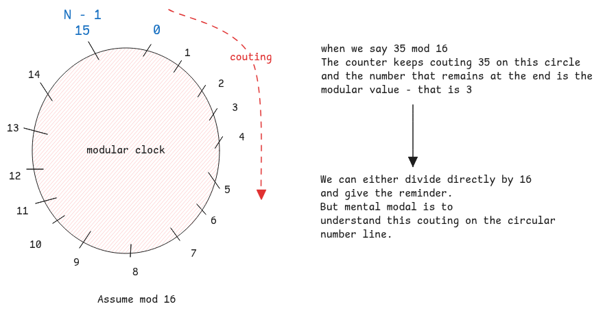

# Modular Arithmetic

It's a type of arithmetic that deals with remainders,
where the numbers **wrap-around** after they reach a certain value.
The remainder value is the mod value of that number.

This is also called as **clock** arithmetic since the numbers here go in a circle.
In N modulo, we can have only 0 to N-1 numbers.

:::tip Mental model for modular operations
It's important to understand that the mathematical way of representing modular is by dividing.
But the right mental model is to see it as a counter on the circle and
**mod is what remains on the circle in the last round.**
:::

:::important Clock is mod 12
When we say clock is **mod 12**, it means the numbers allowed here are only from 0 to 11.
Just for the sake of practical purposes, we've 1 to 12 on clocks.
But the concept is the same.

4 hours after 9 AM is 13 which is actually referred as 1 PM.
:::

## Binary Overflow

Modular arithmetic is the concept that's also implemented in binary overflow.
In case of binary arithmetic,
the overflow bit is just ignored which brings the value back to the beginning of the circle.
See [binary arithmetic](./binary-arithmetic.md#mental-model-for-carry-and-overflow) article for more details.
