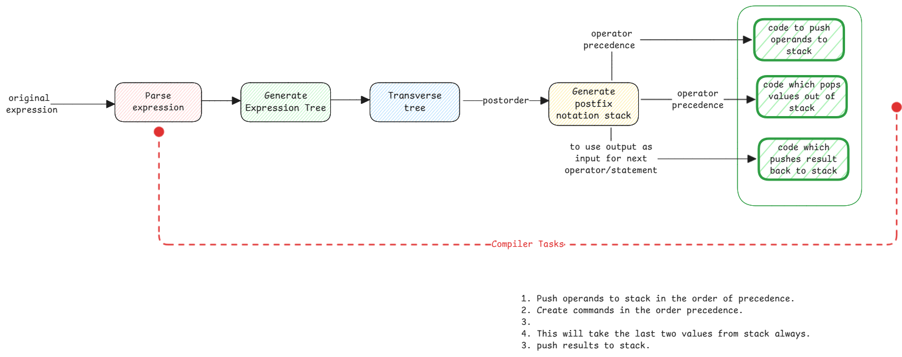

# Mathematical Notations

In Mathematics, an expression is a combination of symbols that jointly express a quantity or a relationship.

1. Prefix Notation (Polish Notation) - The operator precedes their operands.
   Example: + A B (which means A + B)
2. Infix Notation - The operator is in between their operands.
   Example: A + B
3. Postfix Notation (Reverse Polish Notation) - The operator follows their operands.
   Example: A B + (which means A + B)

:::warning infix is most intuitive
This is the most intuitive and human-readable form, mimicking how we naturally write math.
However, it requires parentheses to resolve operator precedence.
:::

## Relation to Computers

For programming languages, parsing expressions in infix notation is complex.
It will also need to know operator precedence and associativity rules.
This is why compilers convert infix expressions to either prefix or postfix notation
which can be easily evaluated using stacks without needing parentheses.

For example, the expression **A + B \- C** in infix notation
is converted to **A B C \- +** in postfix notation or **+ A \- B C** in prefix notation.

:::danger How humans see and computers see expressions?
Reading postfix and prefix notation is just to execute the operations in the order they appear.
Just execute the operation on the next two operands you see.

But in case of programming languages, after the tree structure is built,
the operands are just pushed onto a stack and when an operator is encountered,
the required number of operands are popped from the stack, the operation is performed,
and the result is pushed back onto the stack.

In this example, stack has A, B, C and in this sequence.
Then \- operator is encountered, B and C are popped, B \- C is calculated and result is pushed back.
Then when + operator is encountered, A and (B \- C) are popped, A + (B \- C) is calculated and result is pushed back.
:::

In this case, it's easy for the computer to evaluate the expression.

:::important converting expression tree to mathematical notations
In programming languages like Java, the expression is first parsed into an expression tree.
Then the expression tree can be traversed in different orders to get different notations.
Normally into postfix notation so that the entire expression can be pushed into stack.
:::

