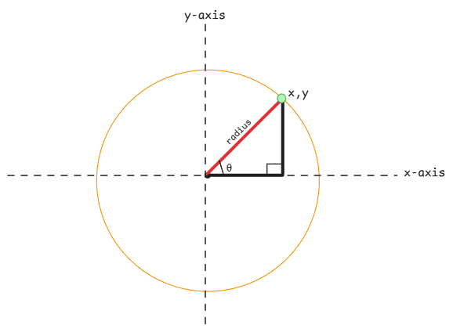
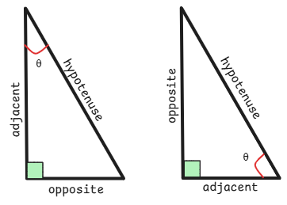

# Sine and Cosine

Sine and cosine are trigonometric periodic functions which relates to the unit circle.

:::note what's Trigonometry
It' is a branch of mathematics focused on the relationships between the angles
and sides of triangles, particularly right triangles.

Trigon in Greek means triangle.
:::

## Polar to Cartesian Conversion

Cartesian conversion is the usual way of representing co-ordinates using x and y axis.

Where as [Polar](https://en.wikipedia.org/wiki/Polar_coordinate_system)
is where the length of the radius and the angle from the x-axis are used.

Trigonometry exactly provides a way to convert between these two co-ordinate systems.

x = r(cos(θ))
y = r(sin(θ))

:::important multiplicate with radius
All trigonometric functions are multiplied with the radius.
This is because the sine and cosine functions assume 'unit circle', meaning a circle with radius 1.

Circumference - 2πR - 2π

This is also why all graphs show the x-axis with π or 2π as the time required for a full cycle.
:::

## Circle

This is the origin of the sine and cosine functions.
Here a rotating point on the unit circle traces out the sine and cosine values.

cosine - x co-ordinate of the point on the circle.
sine - y co-ordinate of the point on the circle.

:::tip Radian in a circle
Radian is the length of the circular arc in a circle and
one radian is equal to the length of the radius of the circle.
:::

## Triangle

Sine and cosine values can be calculated using the properties of a right triangle.
Here the triangle can be placed inside a unit circle and
the sine and cosine values can be calculated using the below formulas:

sine - opposite / hypotenuse

cosine - adjacent / hypotenuse

:::warning opposite and adjacent is relative
Opposite and adjacent values are relative to the angle θ
and this angle depends on which of the two available angles is being considered.

:::

## Oscillations

It's just a coincidence that the oscillations such as swing, pendulum,
and sound waves can be described using sine and cosine functions.

That's why physics uses these functions to describe the behavior of waves and oscillatory motion.

:::danger No relation to circle or triangle
There is no real relation to circle or triangle here.
The movement forms the same sinusoidal shape and hence it's used or referred to.
:::

## Inputs to Sine and Cosine Functions

## Theta

Whenever sine and cosine functions are evaluated, the angle (often denoted as θ, or "theta") is the input.
But this input variable not really used by the function.
It just denotes that the x and y variables are related to the angle θ in the unit circle.
As the angle changes, the values of x and y co-ordinates which is nothing but cosine and sine function output also change.

## Time

In the context of oscillations, time is often used as the input variable for sine and cosine functions.
As time progresses, the angle θ changes, which in turn changes the values of the sine and cosine functions.

:::important Time Dependency
Even though the x-axis shows the co-ordinates of the moving point,
in real life cases, it refers to time.
:::

## Frequency

Frequency refers to how fast the event completes one full cycle.
In case of the object circulating the unit circle,
the frequency is determined by how quickly the angle θ changes with respect to time.

:::note useful links

- visualization[https://setosa.io/ev/sine-and-cosine/]
  :::

## Sine and Cosine in Computation

Computers have no idea of angles or triangles.
They only understand numbers and can compute the sine and cosine values using mathematical formulas.

So the libraries that build trigonometric functions use Taylor series formulae to calculate these values.
