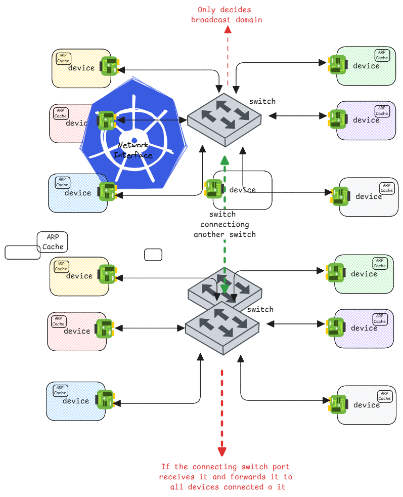

# Address Resolution Protocol (ARP)

ARP is the process of converting IP addresses to MAC addresses.
It's a broadcast based protocol that's sent out on locally connected devices.

:::warning who can send ARP requests?
Any device in the subnet can broadcast ARP requests.
Not just gateways.
:::

:::info ARP old dumb switches and hubs.
In old dumb switches, the broadcast of ARP requests were sent to all ports of the switch.
This is exactly how ARP was originally designed to work.

This is inefficient, since a switch can have devices that are connected to different networks.
:::

## ARP is a pure end device function

Switches need not do anything special to handle ARP requests.

1. End devices send out ARP requests with a broadcast MAC address (ff:ff:ff:ff:ff:ff).
2. Switches simply handle it like any other broadcast frame
   and forward it to all ports in the same broadcast domain.

:::danger Only task of switches with ARP
Only task of switches in ARP is to ensure the broadcast domain is decided and
forwarded only within the correct broadcast domain.
:::

:::tip Even ARP cache is an end device function
Switches don't maintain ARP caches.
Only end devices maintain ARP caches to store IP to MAC address mappings.
:::

## ARP in switches with VLANs

In case of switches with VLANs, it broadcasts the ARP request only to devices within the same VLAN.

1. If the switch port has just one VLAN assigned to it (access port),
   then the switch automatically adds tags to the ARP request and only forwards it to ports that are in the same VLAN.

2. If the switch port has multiple VLANs assigned to it (trunk port),
   then the switch expects the device connected to that port to add the appropriate VLAN tags to the ARP request.
   Otherwise, the switch will add the default/native VLAN tag to the ARP request before forwarding it.

## ARP between switches

When a switch is connected to another switch,
the ARP broadcast is sent also to the other switch.
Just consider it as another switch or another way of adding more ports to the same switch.
